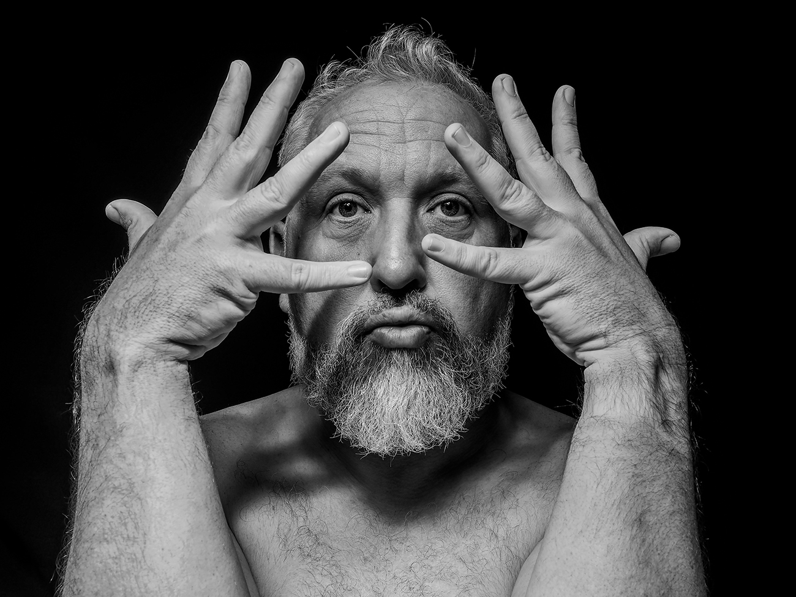

I’m pleased with this photograph. I like the black and white tones, the shadows and the detail captured. I changed some camera settings this weekend, making setting focus and checking the shot’s framing easier. A small win, but making my workflow more efficient reduces the draw on my time. The black background is also a new addition. I’ve had an old set of background stands in the garage for some time, so it’s nice to have some new fabric to hang and use finally.

### Making plans

In a previous post, I mentioned going part-time and dropping a day of work each week to explore other uses for my time. This is increasingly likely, but I haven’t finalised a date for the change in the diary yet.
Last weekend I started drawing up a list of all the materials and tools I might need to extend our garden patio to give us more space for furniture and potted plants. I have no experience in laying patio slabs. Still, the youtube videos make it look like a suitable enough task for beginners, and having this extra day a week is a sufficient excuse for me not to pay someone else to do the job for me.

In addition to planning for my increased work-life balance, we’ve also been putting some time into making plans for the summer. We’ve booked a few days to Vienna for Chloe’s 40th birthday celebrations in August. Chloe is a big fan of Gustav Klimt, so seeing [The Kiss at the Belvedere](https://www.belvedere.at/en/kiss-gustav-klimt?) is a real treat. I’ve found a parkrun for us to complete nearby 😂. Anything else we do will be a bonus.

We’ve also agreed on some other dates during the Summer when we plan on camping in the UK. I’ve always had a love/hate relationship with camping, but I want to try and approach these trips differently. We won’t be accompanied by children or dogs anymore, which sets a different tone, lessens the work involved and hopefully makes it more enjoyable. For the first trip, we’ll stay local and head into Devon; after that, we have Whitby and some English forests on our shortlist.

So summer plans are already taking shape. Landscaping, Vienna, UK Camping - Not to mention a [Bastille](https://www.bastillebastille.com/) concert, my own birthday weekend surprise, and what I hope will be lots of swimming trips along the Dorset coast. Let’s cross our fingers that we have good weather. Oh! and I’m only one month away from my new tattoo. Exciting!
