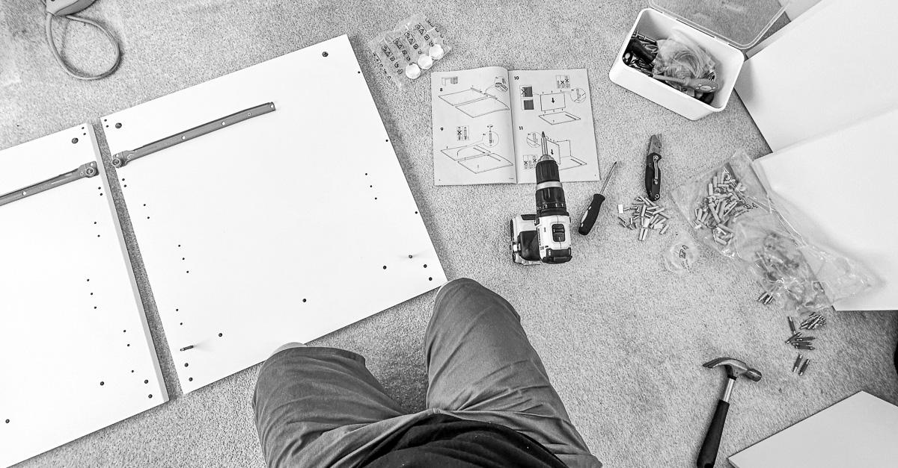

I'll keep this one brief. Changes on the domestic front continue to move at pace and have consumed most of my energy outside of working days. Writing this is a struggle through the fog of jobs to be done and things to process.

## Work

The new project has started well, but there have been a few instances this week where the team has yet to feel entirely aligned on where we're heading and how we get there. It's early days (1st sprint), and I'm confident this will improve as the first set of artefacts help us build a common language and make prioritisation easier. I'm looking forward to a retro next week to gauge how the rest of the team feels and how we might collectively address anything holding us back or causing friction.

I got called into several discussions about internal projects. A lot of work is being done across the organisation to improve various aspects of the client and employee experience—so much so that it can feel hard to keep up with it all. Increasingly, I've felt a little frustrated at the lack of transparency, join-up, and opportunities for collaboration across all of these things, so it was good that at least one of these discussions was about a piece of work that might help resolve some of that frustration.

Next week, some new client project work is on the horizon (but I have yet to learn much about it). I also continue to manage conversations about a few small bits of future work. I have leave booked over the next few weeks to give myself four-day weekends and three-day working weeks. I must be careful juggling my time, changing context, and not taking on too much in these short weeks.

## Home

There is a lot of change. My wife has keys to her new place and will move things incrementally over the next few days. Things are being put into boxes, and things at home here feel increasingly messy and hollow—both in the physical environment and in my brain. I've spent a lot of time thinking through and starting to make minor changes to the house, so it might work better for me when I begin to occupy it solo (This has also been a nice distraction from getting stuck in all the feelings).

This week, I concentrated on the office space. When we moved in, I intended the space for work and play. Over time, I've found that I don't use the room outside of work hours, which has helped me enforce boundaries and compartmentalise between work and home.

Now that I have more space and time for myself, I plan on moving my hobby-related stuff (guitars, music equipment, and photography equipment) out of the office and into other areas of the house where they'll be more accessible. So this week, I took down the big table that consumed most of the office floor space, replaced it with a much smaller IKEA desk and started to sort things ready to move them.

## Other things

Fitness: A little bit of running and some swimming. I need to do more of both.

TV and film: I'm fidgety, and little has grabbed my attention. We did watch [Chef](https://www.imdb.com/title/tt2883512/) this week for about the 100th time.

Audiobooks: Listening to [Dom Jolly - The Conspiracy Tourist](https://www.audible.co.uk/pd/The-Conspiracy-Tourist-Audiobook/B0BYPC322X) and [Gary Stevenson - The Trading Games](https://www.audible.co.uk/pd/The-Trading-Game-Audiobook/B0CJ9PQ531)
