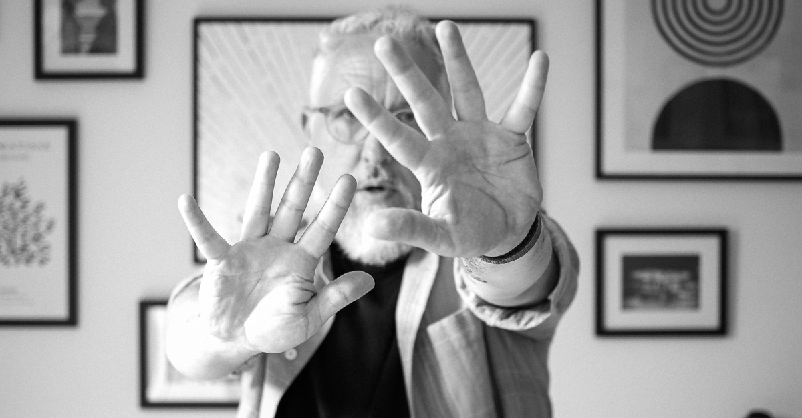

## Excuses

I didn't manage a weeknote last week and this week also feels like a struggle. The biggest blocker I'm facing is that I don't have much to say about work right now. Work isn't bad or boring - it's just...work! Currently the life changes that I'm wrestling with mean that when I sit down to reflect on the week and what I'm learning, these are the things that consume me. I'm confident this will all pass and become more manageable, and then it might be easier to pick out, reflect, and share meaningful progress at work and connect some dots professionally.

Until then, I intend to...

- Continue the writing habit and practice
- Accept that my weeknote output will be biased towards life-life and not work-life
- Share my posts in fewer places (because they'll be more personal and less relevant to others)
- Try to feel less guilt and anxiety about all of the above.

## Update

The last couple of weeks have been a grind. It's been about a month (maybe longer) since my wife moved out. In the first few weeks, I intentionally kept myself busy doing jobs and making the house feel like my place. The busy-busy-ness has subsided in the last couple of weeks, and I've had some days as my new day-to-day reality kicks in where I feel pretty miserable. Increasingly, I grapple with the future I was working towards becoming unwritten.

The last two years have been rough anyway, and I think some depression setting in as a 24-year-old relationship comes to an end is to be expected. I don't want people reading this to worry about me. There have been good days, and I have plenty of good friends, support and tools in my arsenal for working through depression, but I also don't want to hide from it and keep it hidden from these entries like a dirty little secret. We all have struggles, and I will be open about some of mine.

This week, I tried really hard to make it a better week. I knew I was back to work for a normal working week (four days) with plenty of work to fill it. I wanted to double down on my health and fitness as I know this helps me in lots of ways. I also had the delivery of the new EV scheduled for Wednesday, which I was really looking forward to. I was mostly successful, and the week has been ok, but other events conspired to take the shine away (below).

On a parallel track, I awoke on Monday with a sore throat and what felt like an ear infection. Tuesday - my ear, nose and throat all felt blocked up, and I was popping lots of pain meds. Things were much the same on Wednesday, but worryingly, the bug was moving south to my lungs (I have asthma and chest infections always hit me hard). Thursday, I woke up and struggled to breathe when climbing the stairs. I admitted defeat and called in sick. By some miracle, I got an appointment at the GP surgery at lunchtime. The doctor gave me a good check-over, laughed hysterically at my pitiful peak-flow test results and sent me home with a cocktail of antibiotics and steroids and suggested rest. I'm hoping the drugs kick in quickly - I really would like to enjoy the new car more than a trip to the pharmacy :(

## Grow

So, despite all the moaning, depression and sickness above, here are some things I could be celebrating.

- I have a car again - freedom, escape, convenience and in climate-friendly package
- I am still smoke-free and starting to feel better for it
- Have continued to swim a couple of times a week. I managed one sea swim before the sick hit me!
- I've done some running and have plans to do more
- I have been meditating - almost daily use of headspace this week, struggling to focus most days, but I'm making the time for it
- Weight - down a couple of pounds!
- I have played my electric guitar at least once. I'd forgotten the joy of my electric vs my acoustic guitar - what I lack in skill can be more easily hidden by distortion
- I have used my camera and speedlights to create a new profile photo for around the interwebs. The shot above is a silly out-take
- I have been listening to [Natives - Race and Class in Ruins of Empire](https://www.audible.co.uk/pd/Natives-Audiobook/B076HWB9HG) (Akala) and learning lots
- I have read many smart things written by intelligent people who share in my network. Thank you all.

That is all I have for now. x
