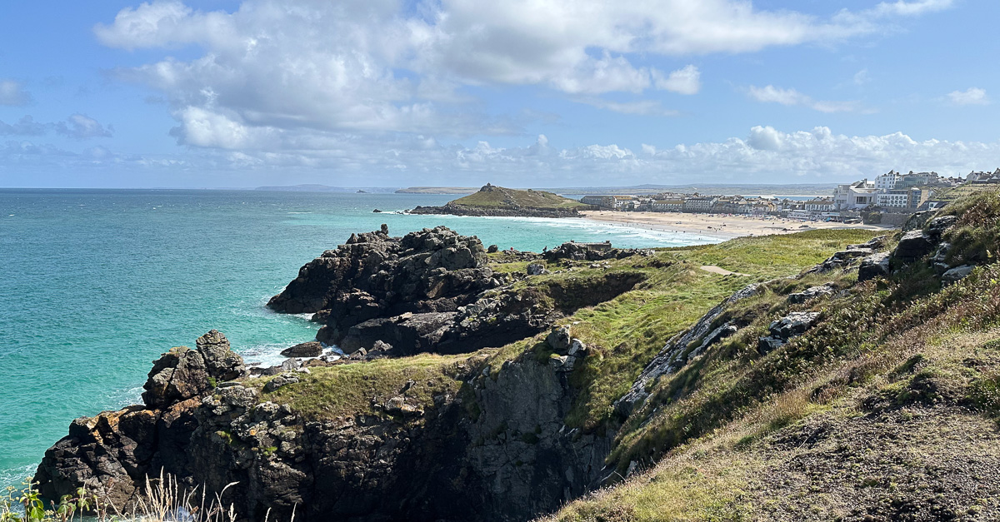

## More excuses

Yeah, so my weeknotes now land once a fortnight 🤷‍♂️. I'm sorry and not sorry. I've found writing much easier on my non-working Fridays. It just happened that last week, I was away in Cornwall on Friday, which meant choosing to get outside and explore or sit inside and write. I think I made the right choice 😀.

## Work

Things have felt busy. There is a lot of activity across my two client projects, and one team has had a few team members on leave. This was planned, and we'd set realistic sprint goals based on our capacity. Despite this, I've found myself leaning into both DM activities and Service Design so that we can keep up the momentum (and maybe I'm just impatient 😬).

One project has completed some excellent user testing sessions in the last couple of weeks. These early sessions have confirmed that we're on the right track but also given rise to some interesting new ideas and risks that we'll need to consider. To most readers of these notes, testing early low-fidelity service/product prototypes with users will be second nature. However, this step is still rare or skipped in many public service organisations and exposing client teams to this way of working is a part of this job I've always enjoyed.

Outside of projects, I still have a few future work opportunities I'm trying to shape or land. One is new and exciting. It came to us/me because we had done some excellent work for the client in the past and had built a good ongoing relationship. I'm keeping my fingers crossed we might be able to do more outstanding work with them soon 😀.

## Cornwall

As alluded to in my opening excuses, I spent a couple of days in St Ives over the bank holiday weekend. It was a needed change of scene for my daughter and me and an excellent opportunity to take the new EV for a longer drive. In the end, we stayed for three days, and those were spent walking, eating, swimming, mooching, and resting. Lovely stuff.

There were some lowlights, including a little anxiety/panic attack one morning. It was nothing significant; it was just frustrating as I hoped I was past these. The new EV (which performed admirably throughout the trip) picked up a small door dent from some inconsiderate numpty in the car park. Grrrr.

It was a good trip, though. The highlights were the views and one evening spent 'out-out' with Robyn. Many cocktails were consumed, and much silly fun was had.

## Dating - peaking into the abyss

Fuelled by both curiosity and my ongoing fear of loneliness, I signed up to 2 online dating apps/services this week. I vaguely knew what to expect as I have friends who've shared horror stories with me before and explained some of the basics. Knowing and experiencing first hand though are different beasts.

The main things that have crossed my mind so far;

- Judging people—we all do it; it's normal. But this forced, engineered, algorithmically enhanced version of judging people (and being judged) based soley on a few pictures and some basic prompts feels so horribly cold and grim. It's really icky.
- Hats off to the designers and developers of these platforms and services. Slick experiences are cleverly engineered to keep us all hooked and paying through the nose to be seen or make connections. It's evil but also a masterful demonstration of product skill across various disciplines.
- After what feels like hours of swiping and scrolling, only four women out of hundreds registered within a 50-mile radius of me DON'T PADDLEBOARD. WTAF. I knew it was popular, but SRSLY?
- I currently have next to zero confidence that I'll ever make a match with someone, let alone progress to a date IRL. I'll continue the experiment for a while longer (I paid a 3-month subscription). Mostly I'm doing this as a source of funny anecdotes to share with friends about how much of a hopeless case I am. FML 🤦‍♂️

## Other things in my head

- Robyn goes back to Bournemouth at the weekend. I'll finally be proper solo and home alone from Monday. It's going to be odd 😐
- It's my Birthday tomorrow. 45 years old. Meh 🎂
- I lost a couple more pounds (weight - not just dating app subs) 📉🎉
- I have done some running, but a few knee niggles going on 🏃🏻‍♂️🏃🏻‍♂️
- Meditation fail ❌ - Can do better!
- A couple of sea swims but not been to the pool 🏊🏻‍♂️
- Next to no reading (not even other weeknotes) - Must do better!
- Audiobook currently [Scary Monsters and Super Creeps by Dom Joly](https://www.audible.co.uk/pd/Scary-Monsters-and-Super-Creeps-Audiobook/B09XJFCCHD?ref_pageloadid=UsMdgAlHmYgbyGOg&ref=a_author_Do_c9_lProduct_1_3&pf_rd_p=af5062e9-57de-425c-9e02-6d8ad006b9aa&pf_rd_r=NPSG2Z074M9WA6TTA3HD&pageLoadId=o8OMGP9C8y6drvdK&creativeId=83220593-1d50-4883-bad4-b5d505543719)
