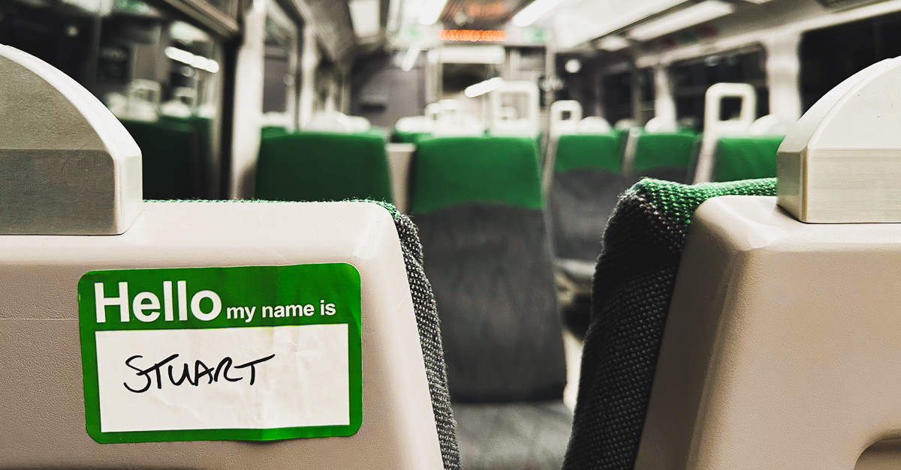

I'm back to do some writing after taking a break. Did you miss me? 😂

Things have felt positive this week. I returned from leave on Monday with a few things to catch up on but I didn't find any blazing fires to put out.

One of the things that I've been thinking about a lot this week has been organising and optimising for work/things of different sizes/shapes. Partly, this has been down to some client work with an MHCLG team, but some conversations about internal TPX processes have also reinforced this train of thought.

I'm thinking about problems that happen when scaling (programmes, services, organisations, etc). Things will work fine initially, but the cracks soon appear if you need to start to process a greater diversity of 'thing' aswell as increase the volume/throughput. It can become far from optimal to blindly apply the same workflow/rules to everything (due to the increased diversity - one size doesn't fit all), but equally processing everything in a unique/bespoke way isn't viable at the increased scale. Solutions often involve filtering, grouping/categorisation, and then right-sizing different versions of the original process to handle these new categories. I'm mulling over whether I can develop different strategies that could more consistently be used to avoid or better anticipate (and intervene) when I spot similar issues. Abstract but if you have thoughts let me know.

## Product for the people

On Thursday, I attended my first [Product for the people](https://productforthepeople.xyz/) event. The cold early morning start and slow trains to and from Bristol did nothing to take the edge off a really good day. Things kicked off with fantastic talks from [Beth Brown](https://www.linkedin.com/in/beth-brown-098423102/) and [Andy Dudfield](https://www.linkedin.com/in/andrewdudfield/). The rest of the day was unconference-style, which worked well, and I took something away from all the sessions I attended.

I often feel very anxious and uneasy at events like this, but the vibes at this were good and chilled. It also helped that there were 4 or 5 people I'd met before and a few others I follow virtually. My super smart colleague [Harriet](<[https://www.linkedin.com/in/harrietpugh/]()>) also attended, and I got a nice hug from [the man, the myth, the legend (Jukesie)](https://digitalbydefault.com/) upon arrival. Thanks to him, Debbie, Steve and Ben for their hard work in making it happen.

## Life

I'm doing ok.

Currently enjoying:

- Running much more consistently. I've joined one of my [local running clubs](https://dorchester.runriot.uk/), and they are a friendly, supportive, and often sociable bunch of people.
- Bread. After listening to the audiobook of [Ultra-processed People by Chris van Tulleken](https://www.audible.co.uk/pd/Ultra-Processed-People-Audiobook/B0BL1M9XCL), I decided I'd get back into baking again. A tasty and therapeutic pursuit indeed.
- Photography. I'm celebrating feeling creative again. I went through a spell where I had the urge, but the outputs/ideas were often dark, and I wanted to avoid that. That's changing and I really enjoyed [shooting this little set of self-portraits](https://www.instagram.com/p/DCkLQvqNMNo/?utm_source=ig_web_copy_link&igsh=MzRlODBiNWFlZA==) the other week and a few people have mentioned how much they liked them.

Not enjoying:

- Dating. FUCK THOSE APPS. SRSLY?! Yeah, I'm undateable...I'm ok with it 😐.

Hopefully back soon. Have a great weekend.
x o x
