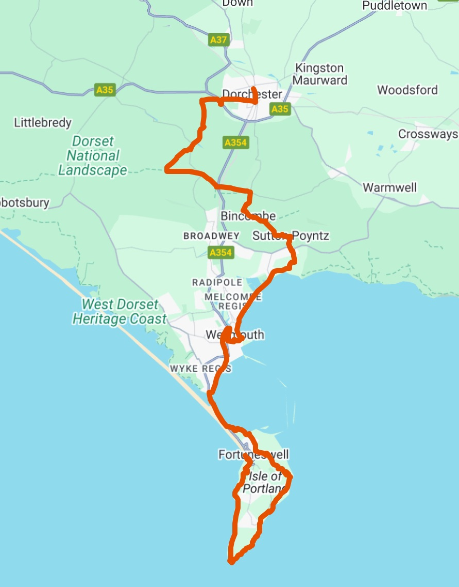

 On August 31, 2025, I'll turn the ripe old age of 46 years old (I know - I don't look a day over 52!). To mark this occasion, I've decided to set myself a little challenge on Saturday, 30th to walk 46km (28.5 miles). I set myself similar challenges in 2012 and 2013, where I ran 26.2 miles with friends over a similar route.

I'm nowhere close to being marathon fit these days but I like the idea of setting myself a physical goal and turning a day that could easily see me alone and consumed with grumpiness about my advancing years into something that forces me to hang out with cool people and leaves me with that grin that creeps across my face when I'm reminded of what this stubborn old git can still accomplish when I put my mind to it! 

I've drawn out the approximate route on google maps and that can be [found here](https://www.google.com/maps/d/edit?mid=1X2fkovQltCrDw7hcm0KxNsPTTaVrm3A&usp=sharing). 

Details will be confirmed nearer the time, but the rough plan in my head is to start over near the Cove Inn on Portland between 7 and 8am. My best guess is that with some breaks for refreshments, and 1200m of climb along the route, this will take me approx 11-12 hours to complete. That should see me limping back into Dorchester and be ready for some beers, food and partying between 7 and 8pm - hopefully celebrating reaching my 46th year at midnight if I haven't passed out or been taken to hospital first 🎉.

I could and will do this alone if needed - but I reckon it'd be much more fun to have some company along the way, and maybe you are also looking for a challenge? **So this is an open invite to friends, acquaintances, colleagues and even the odd random stranger to join me on part or all of this little adventure. It doesn't matter if you want to join me for 1km or all 46km I'll be happy to have you join in.**

[If you are interested (even if it is just to help me celebrate at the pub afterwards), please complete this form and mark the 30th August in your diaries](https://forms.gle/vPa9XTHRmVftogJX9).
