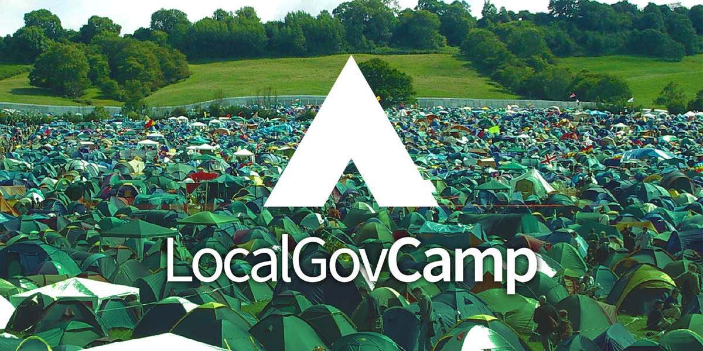

> This was originally posted [here on Medium and cross posted to FutureGov's blog page](https://blog.wearefuturegov.com/my-localgovcamp-experience-15412b7ad314) - As I'm no longer using medium I have copied below for the historic feels!!

Recently I had the pleasure of attending my first [LocalGovCamp and Fringe!](http://localgovdigital.info/localgovcamp/) FutureGov was one of the event sponsors, so a few of us went along to lend a hand and also participate at the unconference on Saturday.

Having worked in local government before joining FutureGov, I’d heard of the event but never attended. So, as you can imagine, I was excited to finally have the chance to witness first hand what all the fuss was about. It was worth the wait.

## Friday Fringe

I’m unsure of the exact numbers, but there must have been around 100 people at the event. So before too long, I’d spotted plenty of familiar faces — including a few of our local government clients.

The event kicked off with a talk by lead sponsor, Arcus Global, and attendees then headed into the variety of sessions. I had hoped to attend some of these myself, but with some project loose ends to complete first, I stayed in the main hall for a little while to clear the decks.

Further thoughts to attend sessions were then scuppered by the success of our own event marketing plan. It was short and simple — “Let’s not have an event table but just go around and chat to people”.

This plan, in combination with my chosen attire of black FG tee with ‘Militant Optimist’ stamped across the back, seemed to deliver. I was easily identifiable and sought out by a couple of people wanting to talk to us about how we might be able to help. Others wanted more information about the Digital Maturity session we were running later in the day. I love talking about our work, so although I missed a few sessions, I was still a very happy camper.

After the late morning break, Matt and I were grabbed for an impromptu video interview. A new experience for me, but without the time to panic beforehand, it seemed to go ok. I don’t think it made the Channel4 news.

<iframe
  width="540"
  height="540"
  frameborder="0"
  src="https://www.instagram.com/p/BZD6NDLlNKv/embed"
  className="imageRight"
></iframe>

## Digital Maturity

Our sessions on digital maturity and our Digital Maturity Assessment were received well. In the first half, we clarified what we actually meant by “digital maturity” and this seemed to resonate with most participants. Many agreed that true digital transformation means going further than just improving front-end transactional experiences.

At FutureGov, we encourage organisations to consider a complete reboot and design services from the ground up that are fit for 21st-century citizens. This often means looking beyond transactions and at business models, governance and how policies are created.

In the second half of the session, we were joined by Adam who tested our digital maturity assessment model with participants. After delving deeply into the whys and wherefores, the group formulated three reasons for assessing an organisation in this way:

- Start meaningful conversations about where organisations might be in terms of maturity and challenge ingrained assumptions.
- Provide an opportunity for stakeholders to form a shared understanding and a common language around the topic.
- Inform strategy and next steps.

Discussions continued late into the evening — accompanied by a beer or two. And buoyed by the success of the day, a few of us ended up salsa dancing until the small hours. I can confirm that LocalGovCamp people are good souls! (And reasonable dancers).

## Saturday Unconference

Saturday is ultimately the main event of LocalGovCamp — the unconference. Despite feeling a little sluggish first thing (can’t think why), we arrived back at the venue just in time to hear people pitch their sessions that morning. Choosing which to attend was tricky, as they all sounded interesting, but the law of two feet helped us out. I went along to the following:

- Change the language, change the rules.
- Portals and my accounts.
- Chatbots, AI and the final frontier.
- Let’s talk about AI.

Here’s a quick summary of each.

### Change the language, change the rules (pitched by Tom Hoyland)

A really interesting session about the use of language as a tool when working with users and teams (particularly helpful for me as a Delivery Manager). Tom did the topic more than justice and covered some of the science behind it.

### Portals and my accounts (pitched by Linda O’Halloran)

Interestingly, most people in the room agreed that a citizen portal/my account is not required. Not to say that we shouldn’t find ways to improve experiences by intelligently persisting customer data during interactions, but a portal should not be a thing in its own right. It’s a topic we feel strongly about and have previously posted on the topic.

A few raised the point that LocalGov needs more examples of what “good” actually looks like in this area, which led to conversations around supplier standards and guidelines.

Linda raised the idea that a “digital logbook” component could be provided by GDS alongside the identity assurance provided by Verify. Personally, I’m a little sceptical but I’m not sure I completely understood the concept being suggested so I’d be happy to be proved wrong. The first step should be identifying and understanding user needs rather than risk taking a technology first approach.

### Chatbots, AI and the final frontier

This session discussed the notion that chatbots could be used to improve the delivery of council services. For me, I came out slightly more resolute in my own thinking that the boat for council-built bots may have already sailed. I’m not sure this was the purpose of the discussion, but that’s where my head ended up.

Don’t get me wrong, conversational UIs are great, but I wonder if it’s a better use of time to open up council data and work with the bots already out there rather than create new ones? With Amazon Alexa, Google Assistant, Apple Siri, Facebook and Skype Bots on the rise, is it really a sensible time to be building or buying proprietary solutions? Again, do tell me if I’m wrong…

I didn’t catch the pitcher’s name for this one — sorry! If you’re reading this, do let me know.

### Let’s talk about AI (pitched by Esko Reinikainen)

This was a general discussion about the future of AI and for me personally the most enjoyable session at the unconference. It raised more questions than it answered:

- What should public services be doing now to get ahead of this change rather than play catch-up later?
- What skills and roles will be required for this new dawn?
- How will it affect the workforce, services and democracy?

At times, it felt like we were discussing science fiction. But Esko had plenty of examples to demonstrate that our musings were a plausible reality in the near future.

My takeaway, for the time being, is that all organisations should work towards opening up and understanding datasets if they want to get value from emerging technologies. But equally, this should be done transparently and with a concentrated effort to understand and manage data ethics and consent.

Sat on the train home, my throat was sore from all the talking and my brain tired from all the thinking. Two strong signs of a good event. LocalGovCamp is amazingly well organised and I’d definitely recommend it to anyone working in or around local government. Lots of great content combined with swarms of interesting people wanting to collaborate.
