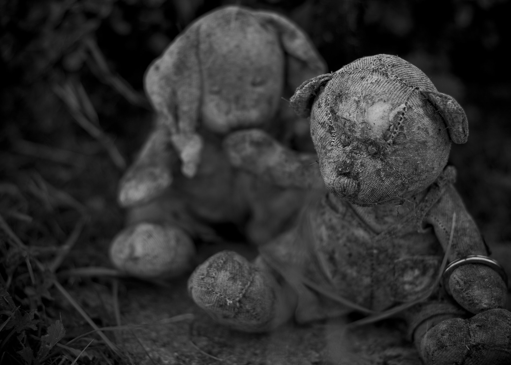

> This is a repost of the image and text I shared last year on instagram at the end of baby loss awareness week. After posting I had two people come and talk to me about recent experiences they had gone through, who seemed genuinely grateful that I shared (I don't often get this reaction to my social posts 😂). I repost with the same sentiment. Baby loss is common and hard on all of those involved. It's important we talk about it and support each other, fighting to help improve bereavement care.

These two toys once sat in a beautiful garden at our local cemetery. That beautiful garden is the resting place of many babies lost before, during or shortly after birth.

Buried there are 3 of my daughters. The twins - Morgan & Bethany and Pob. Time has passed, the sadness has faded but I still hold them dear. 18 years on and I have drawn strength from these experiences but still remember the darker days we went through.

Today marks the end of Baby Loss Awareness Week. Baby Loss is common and hard on Mothers, Fathers and supporting family members. It's important we talk about it and support each other and fight to help improve bereavement care.
Normal cheery Instagram activity of me battling public transport resumes tomorrow. #babyloss #blaw2018 #breakthesilence

