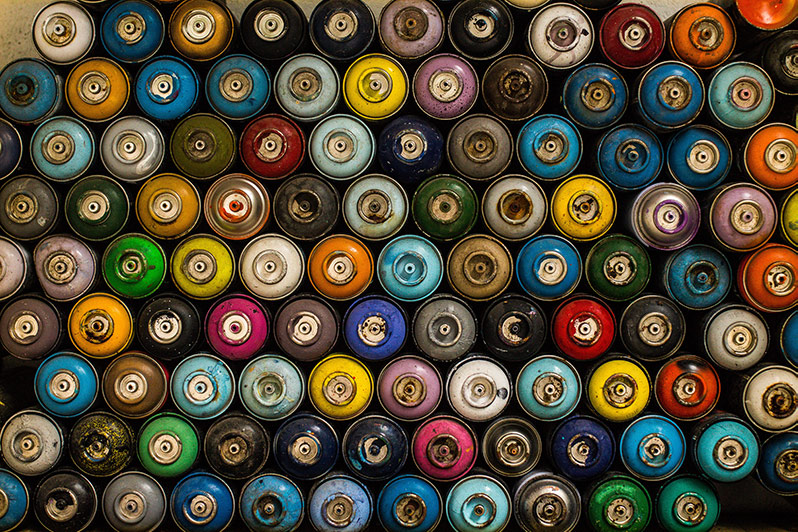

It feels like I change blogging platforms more often than I actually write blog posts...but
rather than just a desire to apply a fresh coat of paint this time my rebuild had
purpose. I had three main goals in mind...

#### 1. Reducing my hosting costs

Considering I seldom post or get much traffic to my website and I burnt through my free AWS credits sometime back paying for an EC2 instance on a monthly basis seemed a stupid waste of money.

#### 2. Apply Learning

I'd been tinkering with a few static site generators and JAM stack projects in my downtime. I wanted a real world thing to build rather than a fictional site for my dog (which I have made already) as this would likely be more rewarding.

#### 3. Take climate action

I'd been doing a little research at work about product design and technology choices in relation to climate action. I wanted to take actual steps (however small, tiny or tokenistic those may seem to be) to move to hosting being powered by renewables (or at least suitably offset) and also explore using page budgets and PWA to reduce compute/storage and data transfer.

**I'm happy to report I've accomplished all three of the goals above.** In addition, I think this might be the best user experience of all of the iterations of my blog/website in quite some time and equally I think i've ended up with a solution which actually works better for me as an author/publisher. Winning!

_If you fancy a long ramble about website nerdery read on to find out more about the changes and my thought processes. If this doesn't interest you then maybe bail out now and go and have a poke around the [rest of the site](http://hellostu.xyz) instead._

### Summary of changes

**Platform/CMS**  
I changed from using the [Ghost blogging platform](https://ghost.org/) to using the [Gatsby static site generator](https://www.gatsbyjs.org/). I really liked Ghost and still rate it highly. As a far as content management systems go it's a lovely user experience that's less cluttered than wordpress or drupal. If I'd stuck to ghost though it was going to be hard to achieve the first two of my goals. I did toy with running it in a [headless configuration](https://en.wikipedia.org/wiki/Headless_content_management_system) with a static generated frontend, maybe even running ghost locally on demand but this seemed needlessly complex for my needs.

I also considered other headless setups with SaaS services like [Contenful](https://www.contentful.com/). I discounted these as an option firstly as it meant I was using an additonal cloud service (potentially adding to my carbon output) and secondly although a content API is a beautiful thing - for a project of this micro scale where I am unlikely to ever want to present the content anywhere other than in this one place it seems overkill.

Discounting headless options led me to keep things simple and to use [markdown files](https://en.wikipedia.org/wiki/Markdown) to store and markup my content. This also makes it much easier in future if I want to migrate content from one static site generator to another. I've recently started using [Typora](https://typora.io/) which is beautiful, themable, cross platform, clutter-free markdown editor. I sync the files using dropbox allowing me to access and write meeting notes across different devices. It also means I can write offline (which on trains is super useful). It's been a long time coming but I think I finally like markdown. Publishing is as simple as copying the finished post into my site folder and pushing to github.

Gatsby was my static site generator of choice purely because I'd played it with before and found it to be both powerful and flexible - compared to some of the alternatives the documentation is also excellent.

**Hosting**  
I knew that moving to a static generated site would effectively remove my hosting costs completely and help me meet my first goal. The site is small so storage is negligble and numbers of page views are low (mostly me..ha!) so bandwidth is also not a concern. There are a range of services out there that will host your static files for free whilst also making it dead easy to deploy from the command line ([surge](https://surge.sh/), [netlify](https://www.netlify.com/), [github pages](https://pages.github.com/), [firebase](https://firebase.google.com/), [zeit](https://zeit.co/) to name a few).

This meant the choice would primarily be made on their green credentials and for this reason I ended up going with Zeit. It had all the features that are important and common across all of the services I mentioned above (simple command line tools, github integration, domain name support, content delivery network) but under the hood it's running on [google cloud computing](https://cloud.google.com/) which from what I could deduce from my research is a more [sustainable choice](https://www.wired.com/story/amazon-google-microsoft-green-clouds-and-hyperscale-data-centers/) than say Netlify which runs on AWS.

_Note: Resources like the [Green Web Foundation](https://www.thegreenwebfoundation.org/) and the [climate action slack](https://climateaction.tech/) community have been useful resources in my research on this subject._

**Carbon optimisation**  
Largely reducing the carbon footprint of a web page is the same process as optimising for performance. You want pages to be small and fast, Smaller files mean less data has to be sent and recieved over the wire. The nice thing about Gatsby is that it's been designed to be pretty damn efficient out of the box - optimising pages to be super light.

There are lots of things I love about Gatsby, one clear winner though in terms of carbon optimaisation is the [gatsby-image](https://www.gatsbyjs.org/packages/gatsby-image/) plugin. It's so easy to optimise image sizes to be used across device / viewport sizes. It also has some neat lazy-loading and art direction [features](https://using-gatsby-image.gatsbyjs.org/) - transforming images to mono or duotone at build time as examples. A sensible way to handle images was crucial for me. I did want to experiment with optimisation but I didn't want to go too far and feel like I was compromising on features and experience.

My first few iterations of the site in development saw me starting from the most basic Gatsby starter and slowly bringing plugins together, building basic components and styling it up using bootstrap. My rationale being that only adding things as I needed would ensure I didn't add any unnecessary bloat. On many levels it was a success. I had a super fast site with all the features I wanted and I'd managed to get the appoximate amount of CO2 produced on a site visit to 0.11g (I know this as I got slightly obsessed with checking it on [websitecarbon.com](https://websitecarbon.com)).

There was one small problem with the site though - it was a little, well....Ugly! It was passable. I could of lived with it for quite some time but it had it's niggles. I'm no visual designer and modern css baffles me (So. Many. Choices!!). I just didn't love it.

I left it alone for a bit...days and weeks. Then I started again.

My second attempt is ultimately what you are reading now. This time I started with a [different Gatby starter](https://www.gatsbyjs.org/starters/panr/gatsby-starter-hello-friend/). This one already looked closer to what I wanted visually, just a few subtle tweaks here and there to make it my own. There was a little more tweaking of react components but that was pretty easy using the learning from my first attempt. This new approach wasn't quite shaping up to be as CO2 light though, I had gained a little bloating. It was still good and certainly better than many other sites but not as good as my first attempt. I removed custom fonts, un-necessary styles and this manged to get it back down a little. I also contentrated on getting top scores in [google lighthouse](https://developers.google.com/web/tools/lighthouse) across the board. I would imagine Lighthouse isn't a perfect tool but its a great way to quickly check performance and that you are meeting basic accessibility guidelines. There is also a cool lighthouse integration built into ZEIT so every build gets tested.

Lastly I configured the site to work as a [progressive web app](https://www.gatsbyjs.org/docs/progressive-web-app/). This obviously has some potential environmental benefits but only really for repeat visitors and only if the user chooses to make this choice. I'm not sure it would ever be used by anyone on my blog - but it's fun to fool around with and again made ridiculously easy to setup in Gatsby.

That's about it. A bit of a ramble - you were warned! Considering I pulled together this iteration over a lazy weekend (including migrating old content into markdown files) I'm pretty happy with the results. I'm happy to have a new site but the practical task of optimising site performance through a lens of carbon emissions was really interesting to me and rewarding in itself. Like many design and development decisions it ultimately became about trade-off and balance. I've learnt a few new things along the way.

Maybe the new paint will even inspire me to publish more posts....maybe 😂

---

Photo Credit:- [Joey Huang on Unsplash](https://unsplash.com/photos/XfIuCOl8kI8)
