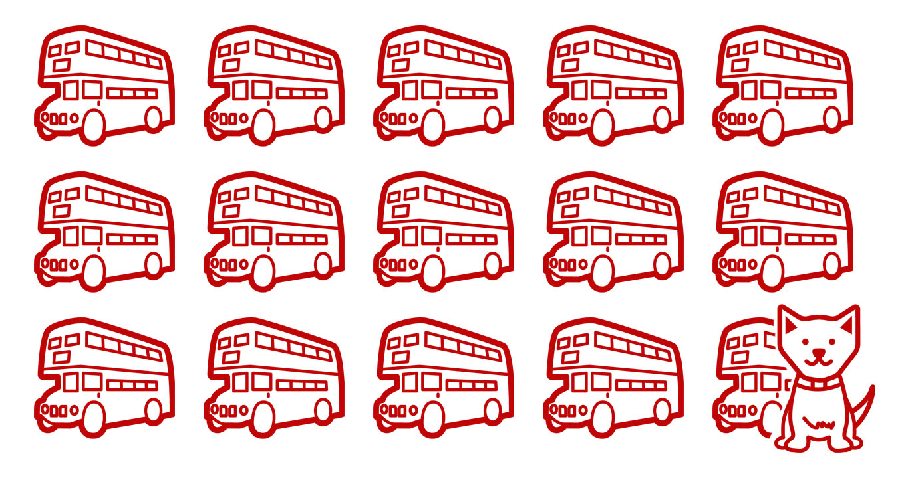

/* import Barchart from '../components/charts/barchart'
import Linechart from '../components/charts/linechart'
import Doughnutchart from '../components/charts/doughnutchart' */

Anyone who follows [me on twitter](https://twitter.com/_disco) will have possibly noticed that parkrun has become a bit of an obsession for me lately. There are a few reasons for this which I'm sure I'll write about another day. The short story though is that I'm currently loving it and in my spare time I volunteer as part of the core event team for [The Great Field parkrun](https://www.parkrun.org.uk/thegreatfield/) which is conveniently just a few minutes walk from my front door in Poundbury, Dorset.

This weekend I decided it'd be an interesting exercise to pull together some of our event data to see what I could learn from the numbers about our little community event. For context I'm no crack data scientist or analyst but thought it'd be an interesting challenge for me to blow the cobwebs off my limited skills and share some of what I found out. Like all my little hobby projects I've tried to document the process. If the 'how I did this' bit doesn't interest you feel free to [skip down to the insights](#insights). 🌳❤️

## Method

Glancing through the the stats on the parkrun website confirmed by suspicions that the data volume for just my local event wouldn't be sizeable enough (yet) to mean that I'd need anything too complex in terms of tools to understand the data. Just getting all of the results into a single spreadsheet would be the simplest and most accessible way for me (and anybody else who might be interested) to start to doing basic analysis.

The parkrun tech fairies and event teams do an amazing job of making sure results from every event across the globe are published in table form on the parkrun website every week and I started by just copying and pasting these into google sheets. It soon became a chore to try and tidy up and clean the HTML elements to get things in the right place and it certainly didn't feel something I'd want to repeat very often.

Some basic research around available [parkrun APIs](https://developer.parkrun.com/) were a bit hit and miss. Plans for anything official look like they had been shelved a while back (which is sad but also understandable). The nerdier elements of the parkrun community (there are lots of us) have seemingly tried to fill these gaps over time by creating many things in this space but many were outdated or poorly documented. [Some seem promising](https://parkrun.js.org/index.html) but look like they'd add more complexity than I wanted to tackle right now.

I decided a suitable compromise might be to use my web browser to [save local copies](https://www.dummies.com/article/technology/internet-basics/how-to-save-a-web-page-in-google-chrome-140687]) of the 20 event results pages into a folder and then create a script to make the process of extracting the data and adding it to a single friendly file of comma separated values (csv) a little less tedious. Moving forward I will keep looking into other approaches/tools as there are limits baked into the results pages that I'd like to overcome (like knowing more about volunteers on the day, and knowing an athletes 'home' parkrun).

Given I am not a developer and that I've never done this before the process of creating the script involved more than a little bit of trial and error, lots of googling and some swearing but what I've written works! 🎉 The resulting script means I can now easily append my dataset with new results every week with a couple of clicks. I could likely automate this part of the process but that's an experiment for another day. The script I created along with a short README file is [available on github](https://github.com/d1sc0/tgf-parkrun-stats) if you also enjoy hacking things together, have [node](https://nodejs.org/en/) running on your computer and want to achieve something similar. For any readers who can write code properly, please be kind - I was born before the internet!

In terms of creating the couple of interactive graphs included on this page I've used a react library called [react-chartjs-2](https://www.npmjs.com/package/react-chartjs-2) to present the data as chart components embedded into this [mdx](https://mdxjs.com/) formatted post on my [Gatsby blog](https://www.gatsbyjs.com/). Screenshots of graphs from the spreadsheet would have also been fine...but far less satisfying for my inner geek.

## Insights 

Over our 20 events we've had people run, jog or walk our 5km course **5355 times**. Added together our participants have covered an incredible **26,675km**! Which is not far from 67% of the distance around planet earth (if you follow the equator). Given our attendance average is about 266 runners (1,330km per week) we should complete our first collaborative trip around the earth by the time we hit our 30th event! 🚀 🌎

Those 5355 finishers actually equate to approximately **1852 individual athletes** crossing the line at our event on The Great Field. I say 'approximately' as within the result set we have 288 unknowns. This is likely made up of people who've forgotten to bring a barcode, maybe never registered or could be the result of an error caused during timekeeping, token sorting etc. Another known group missing from these numbers is those lucky small people safely wrapped up in running buggies being pushed around our course by adults far fitter than me (the TGF parkrun next generation maybe?! 🖖).

### Participation

To put this number of participants in perspective - 1852 people would fill just over **14 London buses** to capacity (with 80 people seated and 50 people standing on each bus). This analysis also doesn't include our 4-legged friends 🐩 or TGF Next Generation™ so I suggest we round up to at least 15 buses if we decide to take everybody out for a picnic!

A stat that suprised me a little was that out of those 1852 folks, **1021 (55.13%)** have taken part at our event only once. Giving it more thought I've concluded that being a new event has meant we've had lots of support & interest and attendees from other established local parkruns plus quite a few tourists from further afield. This trend itself is a positive one that I'm sure will only continue with [rave reviews like this one](https://www.youtube.com/watch?v=OKiYqjq4oew&t=462s). Those 288 unknowns in themselves could balance this number out a bit more also.

Getting the word out to people who've never heard of parkrun or haven't heard we now have an event in Dorchester will likely take a little more time, patience and work from the events team and parkrun community. It's a metric I'm keenly interested in tracking closely - I really hope our little parkrun provides an opportunity to build and strengthen our local community whilst also promoting improved physical and mental health outcomes. The more regular attendees we have, the bigger the potential impact (because people don't often return to events they don't get value from). This is another reason why I'm keen to tinker some more with the stats and find easier ways to guage how many athletes list us as their 'home' event.

I won't share names in this post but I can tell you we've had **4 individuals who've crossed the line at all 20 events** at The Great Field. According to their parkrun profiles two of those four were brand new to parkrun at our first event and have so far (in terms of parkrun attendance) only ever run with us, which is a most impressive streak indeed! ♥️

{/* <Linechart data="attendance" chartClass="imageFull" /> */}

Attendance has only dipped below the 200 participants mark for one event. This happened to be New Year's day so I think we can safely say this is likely caused by a combination of people recovering from the night before or heading out to the [Broadstone quarter marathon](https://poolerunners.co.uk/broadstone-quarter/), which is a popular place to start the new year if you're a runner in Dorset.

Rather than simply list out the number of athletes by parkrun age categories I thought I'd turn to the dark side (marketing 😈) and roughly show how our attendees break down by [generational groups](https://www.mentalfloss.com/article/609811/age-ranges-millennials-and-generation-z). Doing this also helps compensate for an interesting quirk in the stats. When I totalled up the number of athletes against the athletic age/gender categories used by parkrun - I was out by a total of 32! I scratched my head for a while before noticing that 32 attendees in the last 20 events have had a birthday which means they've been listed in more than one age category. Many happy returns birthday people!! 🎂

{/* <Doughnutchart chartClass="imageRight" /> */}

This data won't be totally accurate as I don't have people's actual birthdays and the generational groups won't perfectly align to the boundaries of parkrun age categories but it more than hints at the general shape of age groups attending our event. Clearly my fellow **Generation X'ers are as keen on parkrun as I am with them representing 37.2% of our athletes**. We have 86 young athletes in our Generation Alpha group. It'll be interesting to see if this continues to grow as part of family groups attending on a regular basis or whether it's a bit of a blip caused by event number 15 where young people from Dorchester Middle School joined us to raise money and awareness around young people suffering from [Mental Health Issues](https://dorsetmind.uk/). You can clearly see the impact of this on our overall attendance for event 15 in the line chart above

### Performance

Even when I was much fitter than I am now and training often, I never successfully managed to run 5km under 20 minutes (my [closest effort](https://www.parkrun.org.uk/parkrunner/633637/) falling short by 6 seconds) so I have a huge amount of respect for the people flying around the course that quickly. The graph below shows the fastest finish time at each event for both Men and Women. You can see our **current course record of 16:21 was set at our 3rd event**. It's subtle but it does oddly look like our first finishers times might start trending slower - maybe our marshalls are just providing too much on-course entertainment for these speedsters to concentrate 🧐😂.

{/* <Linechart data="fasttimes" chartClass="imageFull" /> */}

It's absolutely great to see our fastest woman cross the line quicker than our fastest man on the 8th January. We are trying really hard to [encourage as many women and girls to take part in parkrun as possible](https://blog.parkrun.com/uk/2022/02/16/gender-balance-through-the-parkrun-journey/) so hopefully this might become a trend in our results more often.

parkrun really isn't just about the fast few though. The **average finish time across all participants is currently 29:06**. This correlates to the chart below where if we break down our finishers into 5 minute finishing windows the majority of people cross the line between 25-30 mins, followed by the 30-35 minute grouping.

{/* <Barchart chartClass="imageRight" /> */}

For a future experiment I'd be keen to compare this picture to that of other events to see how typical these stats are across the wider parkrun event community. I'm very interested in that white space to the right of the bars on the chart! There is a real opportunity to be promoting our event to people in the community who might not have the confidence to participate or be put off by the number of people finishing ahead of 35 mins. Like all parkruns we have tailwalkers (not runners) at our event who make sure [nobody ever comes last at parkrun](https://blog.parkrun.com/uk/2020/04/20/walking-the-talk/). We've also become the graduation run setting for a couple of couch to 5km groups that are run locally which is fantastic. Posts like [this one from Conkers parkrun](https://blog.parkrun.com/uk/2020/06/30/everyone-is-equal/) though make me think there might be even more we can do to encourage people to be be part of our communuity, share the fun, get active and increase our impact!

## Conclusions and future experiments

I found looking through our event data an interesting little weekend diverson. It certainly got me learning a few new tricks (which is mostly why I tinker like this). I'm present at most of our events and **that experience is way better than trawling through the numbers** but equally I'm usually focussed on a specific task whilst I'm there. This made me step back and look at things from a different perspective. Some of these stats like the times of fastest finishers aren't things I would normally pay much attention to. Looking at this data along with things like the spread of times for individual athletes over multiple events was fascinating. Getting a better understanding of the split between first-timers and repeat visitors certainly challenged my assumptions around our attendance.

I'm definitely going to continue to try and get some meaningful data around our voluteers. Volunteering is such an important part of the event for me as an inidividual but also for the health and sustainability of our event. I feel it's important we understand more about how our volunteers take part and if there are any patterns we can learn from. Much of this we already do through other methods (like talking to each other) but I'd still like to play around with the data to complete the picture.

I'm also keen to experiment looking at event data from other events - both in terms of understanding how successful events grow over time but also just in terms of similarities and differences. Maybe I could start looking for our parkrun event twin?!! If you found this intersting let me know and I'll keep sharing what I find.

_Icon credits: London Bus by ATOM, Dog by Loka Mariella both found at [NounProject.com](https://nounprojects.com)_
