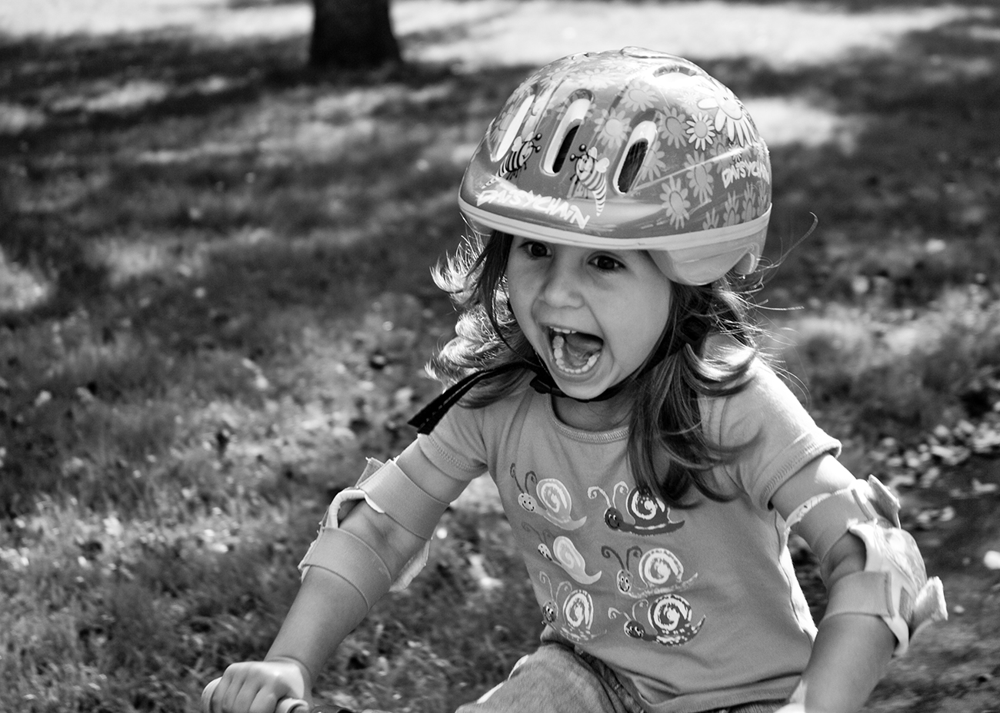
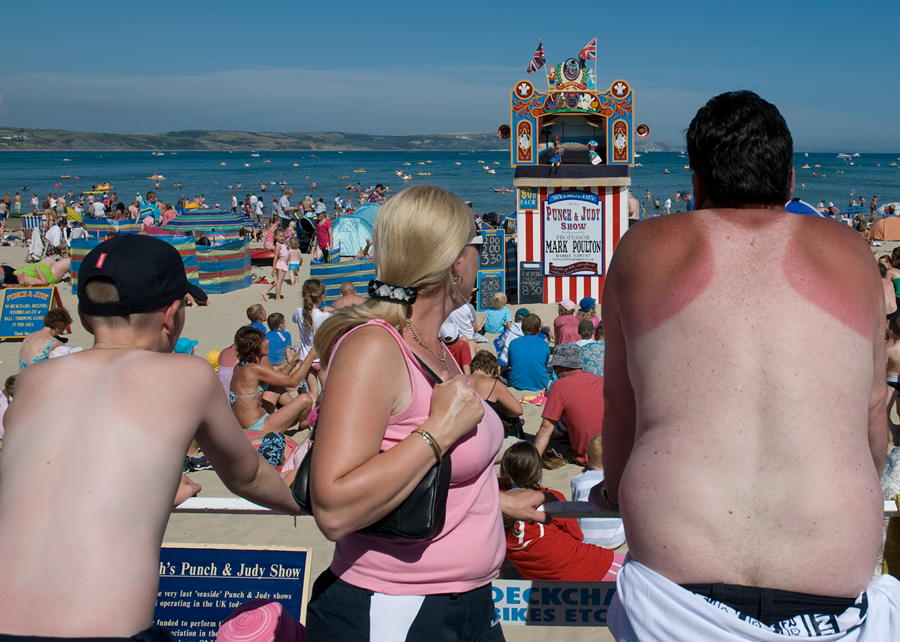
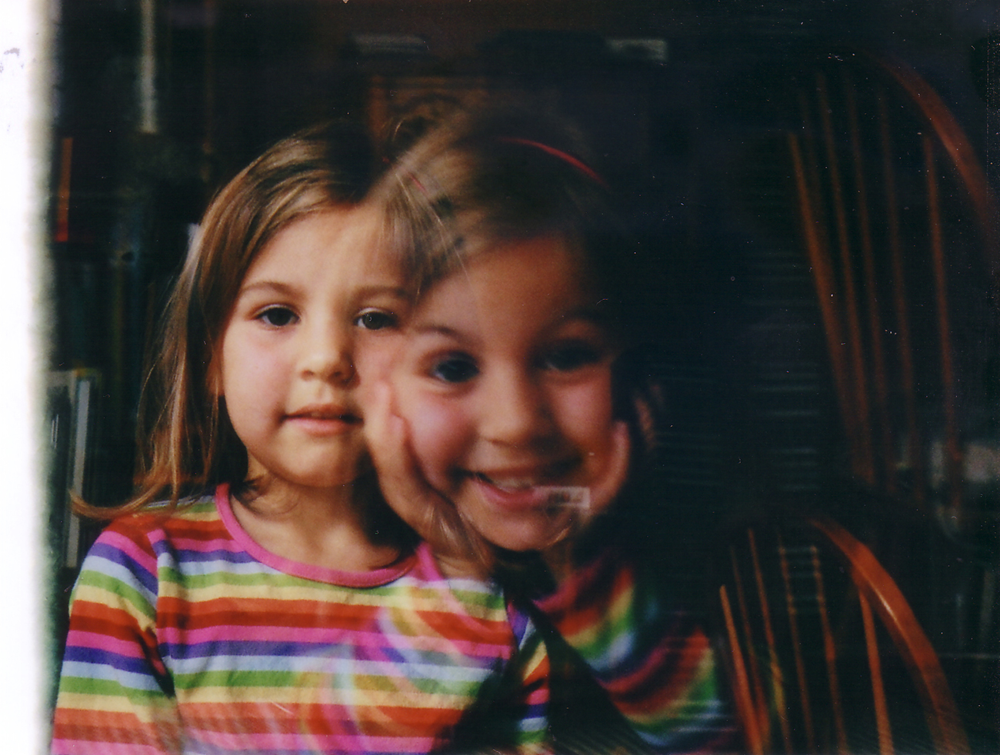
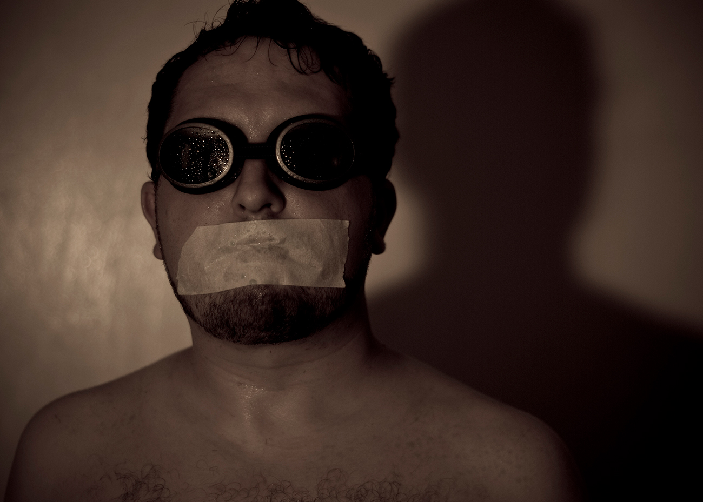
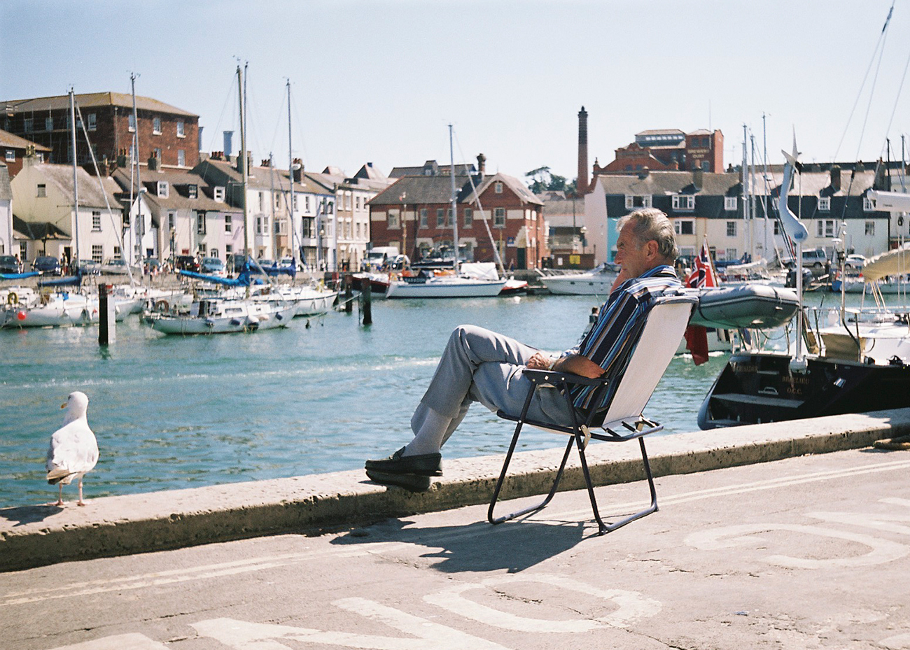
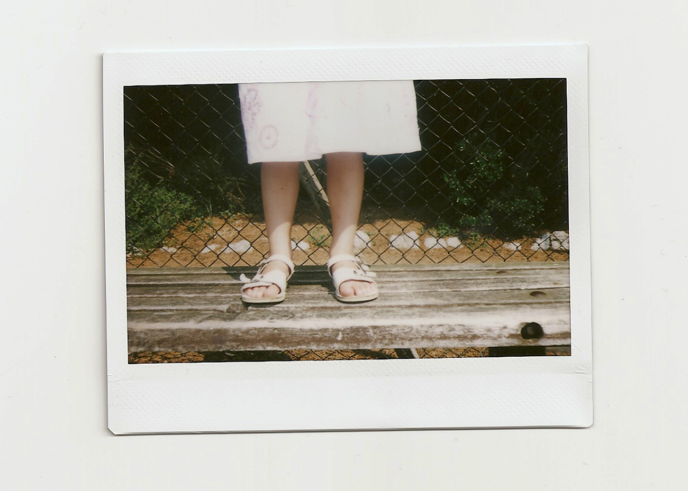
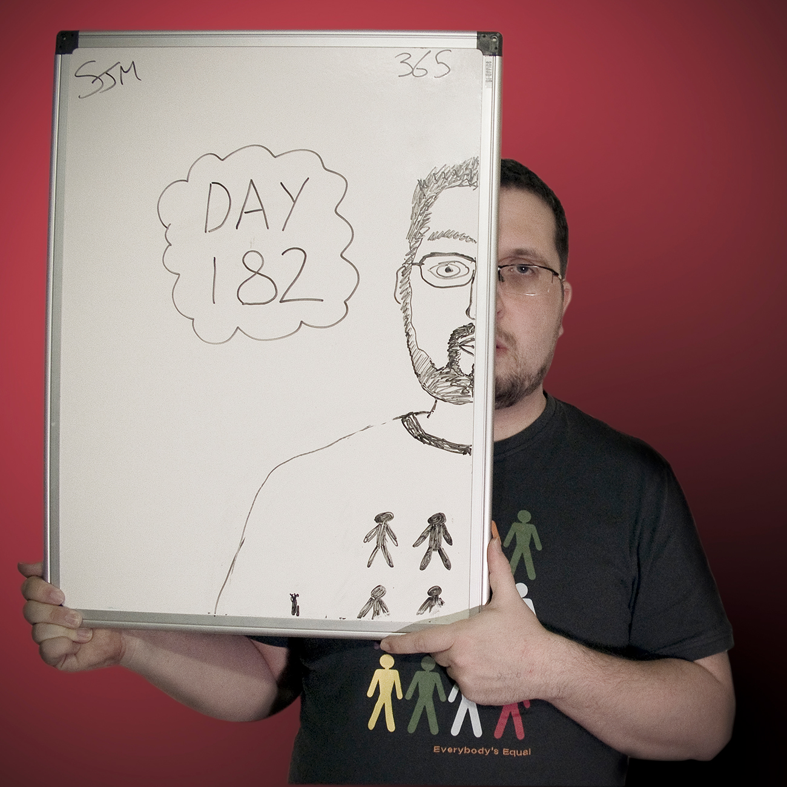
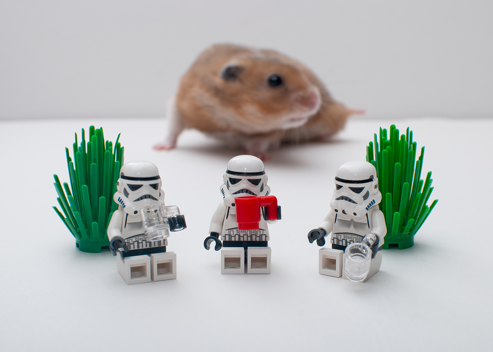
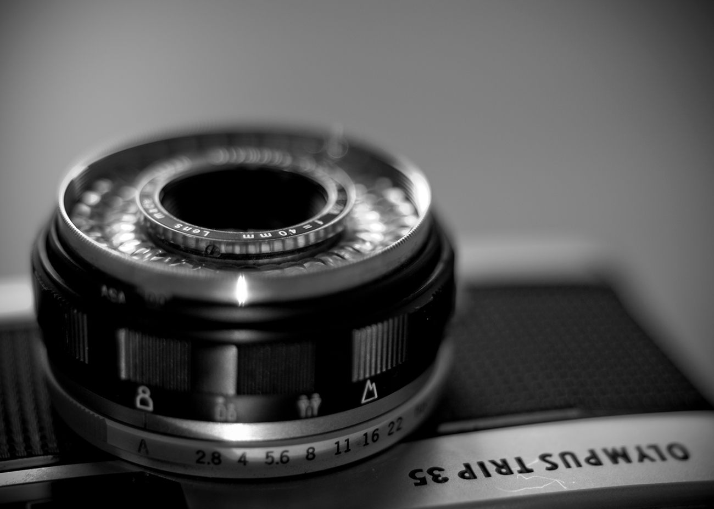

This weekend I finally found the time to [backup all my flickr images](https://www.mlieser.de/apps/adios-flickr) and delete my account. The reason for doing so was purely practical - It's been a long time since I actively posted images to flickr. I no longer interact with any groups and am no longer part of any art projects on the platform. Given I had nearly 3000 older images stored on Flickr, [recent account changes that have come into effect](https://www.flickr.com/help/forum/en-us/72157720619003104/#:~:text=%22Beginning%20May%201%2C%202022%2C,service%20and%20subject%20to%20removal.%22) would soon have soon left me paying for the service or I'd of risk losing my older images and private photos becoming public. The process of backing up all the images and browsing through the albums did stir more than a few memories.

I think I joined flickr in about 2006. Robyn was born in 2002, digital photography wasn't as mature as it is now but it was to a level where it was becoming more common and accessible to document those special family moments with more regularity. The tech was still crap by today's standards, not many phones could take photos and those that could were appalling. Digital compact camera's were also pretty lame. I'd always been interested in photography and I think somewhere around 2005/2006 I invested in a [Fujifilm s7000](https://en.wikipedia.org/wiki/Fujifilm_FinePix_S7000) zoom bridge camera. It offered a lot more control that a compact but it didn't quite come with the flexibility, power or expense of a full SLR setup.

Initially I just joined flickr to store photos online to make them easier to share them with family and friends. A few months later I started following a few other users and gradually became more fixated learning how other people captured great photos. There was (and maybe still is) a totally endless supply of groups on flickr that covered every style, subject, technology, process and project imaginable.

Over the following years I bought and collected all sorts of cameras, lenses, lights and gradually became a proper photo nerd and an _ok_ photographer. I learnt a lot on flickr, met some extremely talented people, made some amazing online friends who became real life friends, completed some pretty bonkers projects, setup a photography business, hosted a photography podcast and even had a picture spotted on the platform and then published in a [book by Martin Parr](https://www.martinparr.com/books/#gallery/8__399884168/443). The time is right for me to leave flickr but I'll always remember it fondly.

These days its rare for me to reach for my SLR or put film in one of my 35mm cameras but I still take several photos a day on my smartphone and most weeks I'll also now grab some goPro footage. The only place I really curate and share photos now is [on Instagram](https://www.instagram.com/_d1sco/). I used to love Instagram but it's journey to be a weird combination of facebook & TikTok seem to be picking up pace and that's not appealing to me.

I may have to carve out some space on this site to curate some images I'm fond of or to document projects. I think I might be finally beyond the gratification that comes with notifications of likes & comments and mostly I just fancy a simple place to point people at the things I've made. Whilst I mull all of this over I've added some images pulled from the my old flickr archive below for your suprise and delight dear reader.

