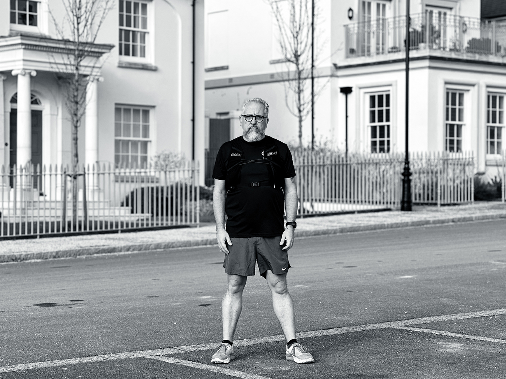

This is the second in my series of self-portraits ([read about more about the project here](/posts/1-seeking-inspiration-and-comfort/)). As I suggested in the first post some of the project would likley be snaps taken on my iphone - and this one falls into that category. I've only recently switched to an iphone and actually I'm quite happy with the quality of this shot. The photo was taken by setting a 10 second timer and propping up the phone precariously on the top of a fence post with suport from a small rock I found nearby. I'm annoyed I've got a bit of a grumpy expression on my face and my hair is all squiffy. This was partly caused by the exhaustion of the preceeding run kicking in and partly by me trying to figure out the camera settings required to get something passable quickly before I returned home to warm up again. Out of 5 or 6 frames this is about the only one where I got the focus right so we'll all have to put up with my silly grumpy face. I guess it adds some interest if nothing else. Tell me what you think in the comments below.

## Talking about running

I've managed 4 runs this week and today was the longest where I racked up 10km up and over several nearby hills. As you can see from the photo above I've not exactly got the physique of an olympic athlete but thankfully you don't have to be great at something to enjoy it and I'm **really** enjoying my return to regular running.

My secret weapon at the moment is my [Nike Running Club](https://www.nike.com/gb/nrc-app) training plan and the guided audio runs that come with it. I was sceptical when my good friend Emily recommended them but actually having Coach Bennett keep me virtual company whilst out on a run is fab. He does a great job of reminding me about some of the running wisdom I may have forgotten over the last few years and he often makes me smile.

I scheduled a training plan that would help me be ready for a local [trail half-marathon](https://www.hardyhalf.com/) in a few months time. If I'm honest with myself I wasn't overly confident of success when I started at the end of last year. I've had lots of failed start and stop attempts to get back into running over the last few years and other than the odd painful few km's here and there nothing has stuck.

This time around I'm already really pleased with the progress I've made. I'm back out running several times a week and have been back in the habit long enough I can really feel my fitness improving and things becoming easier and more enjoyable. When I was previously in good running condition (probably 7-8 years ago) I found running was as beneficial to my mental health as it was my phyisical health with long runs often feeling like a form of meditation - I'm excited about starting to feel the benefit of these things again.

## Elsewhere

It's been a busy week at work juggling lots of projects with one in particular that I've felt the need to lean into a little more and help the team out by dusting off my data analysis and cleaning skills. This was enjoyable but tiring and I'm sure a few other important tasks I should have been closer too have suffered as a result. I spent a couple of days in London which I'd also describe as enjoyable but tiring. My first trip to the city this year and it lovely to spend my evenings catching up with good friends but I left the city concious I have several more I still haven't seen in a long while. Hopefully i'll have plenty of reasons for another visit soon.
