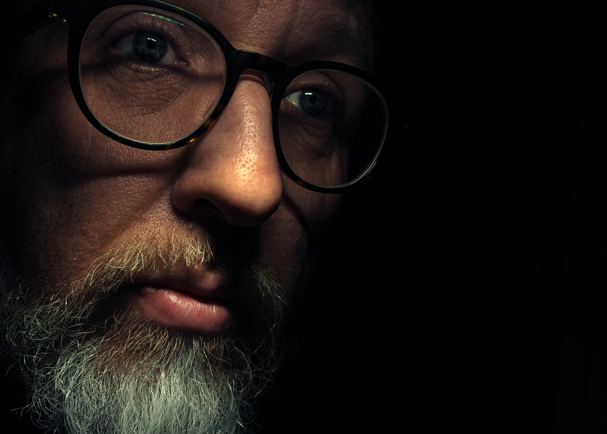

I almost copped out and posted yet another running selfie today! All of the snaps on my phone were pretty lame though and I’m _trying_ not to be lazy with this project. Instead, I reached for my Olympus DSLR and tried to create something a little more interesting. I didn’t have any clear idea, vision or concept in mind so I shot off 6-8 frames of me holding an LED desk lamp over my head in a dark room and then tweaked things a little in Adobe Lightroom. The shot won’t win any prizes but there is something honest and appealing to me about the closeup framing showing my pitted, wrinkled skin, my giant nose and my unkempt facial fuzz. I’m not a model, I’m just a guy, getting older by the day - this is me.

### Weekly roundup

1. Work felt _hard_ this week. Not necessarily in a bad way - I feel like many aspects of the week were pretty positive and I made lots of progress across many things. I finished it tired though and a little burnt out. I often fall into the trap of caring a little too much, which means I can lose perspective, lean in, and obsess over silly details. Next week I need to make sure I do a better job managing my diary and carving out enough time for breaks and balance.

2. I’ve booked a holiday by myself towards the end of the month. I need this break but I’ve never travelled alone before (other than for work). I’m excited and anxious in equal measure. I could write lots more about this topic but now is not the time. I’ll probably write more closer to departure or maybe even write whilst I’m away.

3. I caught up with two friends this week. One I hadn’t seen in over 12 months. Catching up on all of what life has thrown us recently was a little overwhelming but also cathartic. I need to put more effort and energy into some of my friendships.

4. Good chilled weekend vibes. Friday night started with a haircut and bants with Thom at Seventh Seal. Saturday morning involved being Run Director at parkrun - nobody died and 226 folks crossed the line. Chloe and I took a trip to Bridport to rebook a tattoo appointment I had to postpone in November - I’ve been waiting for this one for a while so I’m pleased to have a new date in May and have an ending planned. Today I completed a lovely trail run up along the Dorset ridgeway to Hardy’s monument and then headed to a pub for a lazy Sunday roast.
