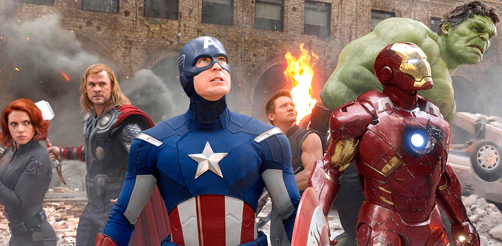

> This was originally posted [here on Medium and cross posted to FutureGov's blog page](https://blog.wearefuturegov.com/what-makes-a-great-retrospective-eef24e1ef9d0) - As I'm no longer using medium I have copied below for the histotic feels!!

As a delivery manager running agile projects, my favourite tool in the agile arsenal is the [retrospective](http://searchsoftwarequality.techtarget.com/definition/Agile-retrospective). Having come from a background where waterfall projects reigned supreme I really appreciate how valuable having regular structured conversations with teams around improving delivery and team dynamics can be. Especially in comparison to the seldom completed and often ignored ‘lessons learned’ logs of old.

There are already [plenty of resources](http://www.funretrospectives.com/) out there which give a variety of retro formats you can try. These can help to mix up the structure of these sessions. Rather than focus on structure I’ve been collating a bit of a mental checklist of the top 5 things to consider before facilitating a retro to try and get the most out of the time.

## 1. Make the time

This one may appear obvious but with busy teams, sometimes working on multiple projects in multiple locations finding time can often be a drag. At FutureGov we try and make sure there is one day a week where we are mostly all in the office. Like most things in agile it makes sense to plan ahead and get time booked into diaires early but be ready to flex and adapt as needed. Although not ideal, we can often have team members joining a retro remotely, usually via a Slack call. It’s important for everybody involved to commit to the process. The more people get out of the time spent in sessions the easier you will find it to get that commitment.

## 2. Celebrate success

It’s often way too easy to focus on all the things which might have gone wrong or could be improved upon. Of course this is important but make sure you give adequate time to focus on what went well and what you’ve accomplished. It’s more than just focus, be positive and celebrate this! If like us you’re lucky enough to be engaged in solving really challenging problems then it should be super exciting when we make progress along the way. Break out the high fives, take a breath, smile, pass around the cookies. Whatever works to give that pat on the back and motivate the team.

## 3. Build better teams

Another important reminder that a retro shouldn’t just have to be about process and delivery. Consider individual needs and skills. What have we or can we learn from each other? What does the team dynamic feel like? What didn’t feel right or not work well? At FutureGov we don’t often work with the same team twice over the course of several projects and because of this we often use these user manuals and run exercises at the beginning of projects to make sure we all understand people’s skills, experiences, how to spot signs of stress, motivations etc. The retro can then become a good opportunity to check in on these and make sure we’re using the best of what people have to offer and we’re looking after each other. It’s also a chance to provide plenty of value to individuals and their personal development needs so it’s good to provide some space for self-reflection. I strongly believe happy team members equate to productive teams!

## 4. Encourage honesty

This one again is also obvious but vitally important. Retro’s should feel like a safe space to encourage people to be honest with themselves and the team. A retrospective is about learning and moving forward not getting bogged down in blame. If working with new teams or client teams unfamiliar with retrospectives I find sharing the ‘prime directive’ below or a variation of it really useful to set this tone from the outset. As a delivery manager you may already have picked up on some ‘elephant in the room’ issues before the session which people might avoid. If so, be prepared with some sensible questions which might help surface these in a constructive manner so as a team you can get these out in the open and address them.

> _“Regardless of what we discover, we understand and truly believe that everyone did the best job they could, given what they knew at the time, their skills and abilities, the resources available, and the situation at hand.”_ -Norm Kerth, Project Retrospectives: A Handbook for Team Review

## 5. Practical Outcomes

Some retrospectives can feel like an amazing group therapy experience. That in itself is pretty cool and is potentially a good outcome but it shouldn’t be the only outcome. Make sure you allow time at the end of the discussion to summarise and also talk about next steps. How are we recording any actions to take forward? What is important to share with other teams and how? How will we know if we’ve achieved the improvements suggested? Allow enough time for this and maybe even have some sprint planning techniques up your sleeve to break down larger tasks so things feel achievable.

---

**Overall a retrospective, is a chance to reflect on what you, the team and the project are doing. Taking that time out is a really important way to continue to improve. The list above is not completely exhaustive and don’t feel the need to squeeze all of these ideas and thoughts into a single session. I’d love to hear what else would you add to my top 5. Answers on a post-it!?**
