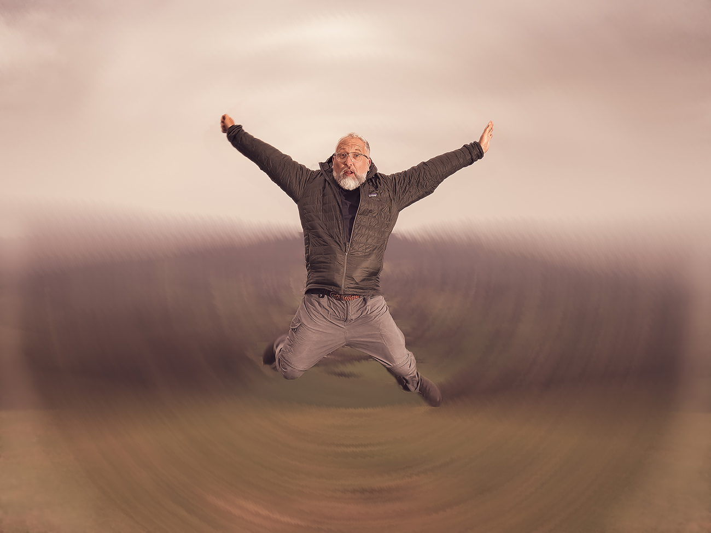

This week I’m back in the more familiar surroundings of Dorset. Not that you can tell but this shot was taken at the top of [Hambledon Hill](https://www.nationaltrust.org.uk/visit/dorset/hambledon-hill). Chloe and I went for a short 5-mile hike around this and another nearby hill fort ([Hod Hill](https://www.nationaltrust.org.uk/visit/dorset/hod-hill)). I thought it’d be nice to get a shot with the beautiful countryside behind me. Chloe stepped into the role of portable light stand and pointed the flash in my general direction (just off to the right of the frame). I set up a remote shutter using my phone and added a 5-second countdown to try and time some jumping photos. This and one other shot reasonably captured me at the right point in the jump, many others just froze me in mid-squat or awkward landing 😂.

When editing shots the jump looked fun, the landscape in the background just felt flat and grey (mostly due to the weather). The overall composition just felt off. So I’ve decided to just embrace the fun element and added some silly photoshop manipulation of the landscape to make it a bit more interesting. You can decide if I’m falling through a portal of time & space or powering myself across the Dorset countryside using some kind of sonic flatulence.

## Elsewhere

Although back from Egypt I’m still on leave until tomorrow so most of my time has been spent chilling. On Thursday we took a trip to Marwell Zoo to break up the drive home from Gatwick. Friday was a bit more pedestrian with household chores, a haircut and a therapy appointment. The weekend has been all about walking, running and catching up with family. I feel quite well-rested and ready for work. How long this lasts…..we’ll see!
