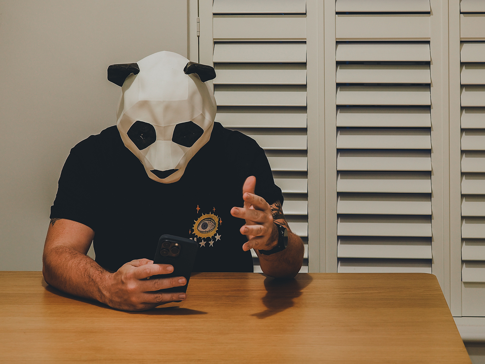

Sometimes you have to abandon interesting locations, complex lighting and creative composition. Some days you need to put on a panda mask and take a snap at your kitchen table. Yesterday was that day…and I LOVE IT! 😂😍

I’m not sure why this is so appealing to me. Maybe it’s just because it’s so beautifully odd. My brain immediately starts to create incredible, absurd backstories to accompany the scene.

I’m not in the mood to share what’s in my head today. There is no particular reason; I’m just tired and don’t want to spend any longer staring at a laptop. A bank holiday weekend fast approaches; hopefully, that will bring more time for reflection and energy for sharing.

I’m also sadly lacking in audiobook recommendations this week. On a musical theme, I’ve been revisiting the fantastic music of [Massive Attack](https://www.massiveattack.co.uk/). I’ve also just clocked a report they commissioned on the subject of ‘super low-carbon live music’ on their website! That could be an interesting read for a panda like me or a human like you.
