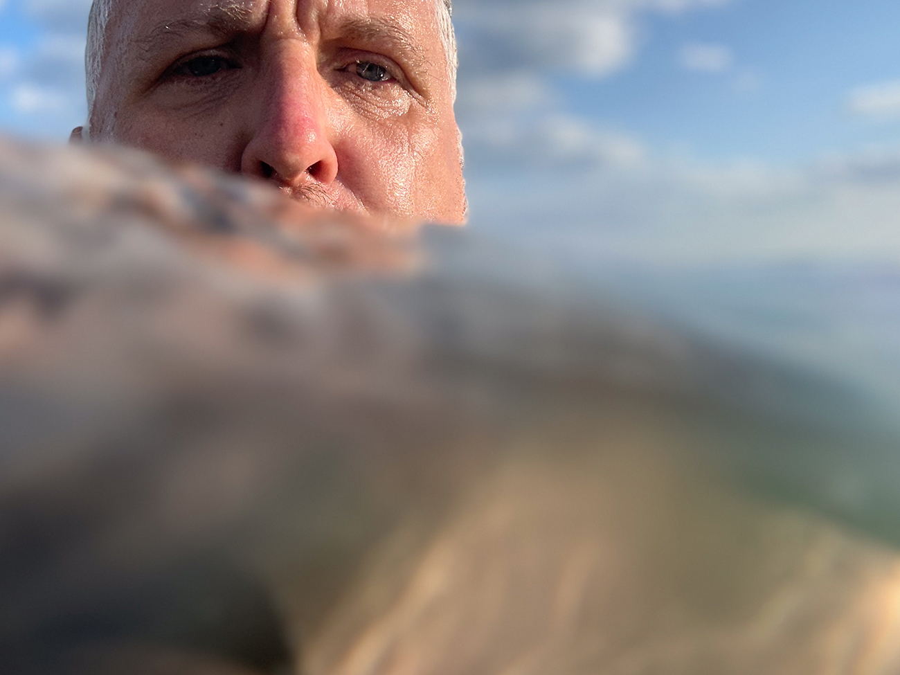

This week I’m posting late and from my bed. I had some planned surgery at the hospital yesterday. Everything went well, but I’m feeling a bit groggy today and numb with painkillers. I’ve taken the day to recover but currently can’t sleep, so I’m trying blogging instead!

Although I’m posting late, the photo was taken on schedule and before the clock expired on the week. It’s an iPhone portrait taken whilst swimming at [Burton Bradstock](https://www.visit-dorset.com/listing/burton-bradstock/112382301/). Most of my weekend was spent catching up on jobs around the house, volunteering at parkrun(s) and generally taking it easy. The weather was so beautiful that Chloe and I made a late decision to squeeze in a swim and mini beach BBQ on Sunday evening. I’m glad we prioritised it, as it became one of the week’s highlights.

### Work

I’ve felt a bit lost at work for a couple of weeks. A combination of change, the scale of the thing now, and an absence of work that challenges or excites me have left me a little unsure of where I’m currently adding value. I guess it’s probably normal or healthy to have some of these slightly slacker periods to recalibrate. Still, it’s also these moments where imposter anxiety can creep in and wreak havoc with my confidence. Good conversations, other changes, and new client work continue to evolve at some pace, so I doubt I’ll feel lost for long. I have noticed that the new part-time regime + multiple bank holidays have played a valuable role in helping me manage any anxiety I may have around work - that’s progress and makes me feel more confident in my decision to make this change.

### Memo from me

Another thing I did over the weekend was start recording a **new podcast**. I had this idea that would allow me to get back to podcasting but do it in a way that consumed less of my time. I spent part of my long weekend testing my theories and the format, buying new audio equipment and setting up the platform. Things are just about finished and ready to share with the world!

Check out [Memo from me](https://memofrom.me) and let me know what you think?

Make sure you listen to the [first](https://memofrom.me/memos/1-start-explaining/) and [second](https://memofrom.me/memos/2-queer-eye/) memos. The first one explains more of the concept and inspiration for the show.

Subscribe on [Apple Podcasts](https://podcasts.apple.com/us/podcast/memo-from-me/id1688887767), [Google Podcasts](https://podcasts.google.com/feed/aHR0cHM6Ly9tZW1vZnJvbS5tZS9wb2RjYXN0LnhtbA), [or Spotify](https://open.spotify.com/show/453GiQnxqnF4x25tIAAuRz) so you don’t miss future memos.

Follow along with the [Twitter](https://twitter.com/memo_from_me) and [instagram](https://www.instagram.com/memofrom.me/) accounts I’ve set up for the show.

### Looking forward to

- The arrival of a new camera body and lens 😱
- Sleep (sometime real soon, please) 🤞
- Camping in Devon this weekend ⛺️
- Bastille gig in 39 days
