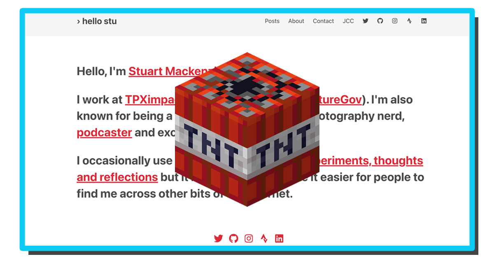
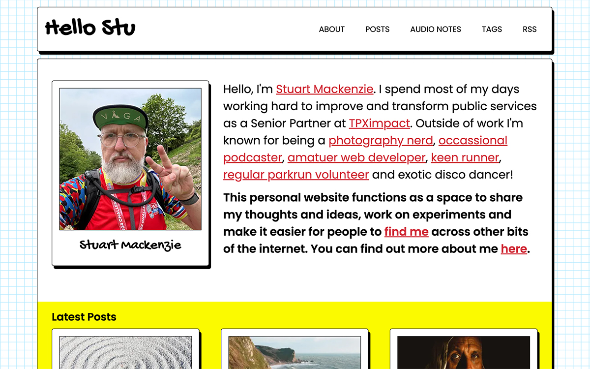

 So over the bank holiday weekend I decided to redesign and rebuild this website. The motivation for this largely just came from a desire to create something - **I wanted to build a thing!**

Many of my projects at work over the last 12-18 months have been at the service, organisation and strategy end of the spectrum. I’m cool with that and I have plenty of experience to bring but a little bit of me has missed being closer to product work and the joy that I get from making digital things.

The old version of the site was also starting to feel a bit stale, bland and dull. Given I don’t post often and when I do it tends to be about my personal life and hobbies, it felt like there was an opportunity to make my personal site look and feel a bit more…err….personal!

So this is the brand new [hellostu.xyz](https://hellostu.xyz). Yes - visual design skills are not my superpower 😂. Not everyone will enjoy the busy aesthetic and wild colours and that’s fine! I’ve purposefully leant into a quirkier, hand-built kind of vibe. It’s not quite the Wild West of the early [GeoCities](https://en.wikipedia.org/wiki/GeoCities) days but I wanted the site to embody some of that early web creativity before our corporate overlords made everything whitespace and widgets.

The rebuild was a great opportunity to play with some new technology - I’m by no means a developer but I find the process of trying to turn the ideas in my head into real things through the medium of code extremely satisfying. Learning, trying, failing fast, problem solving and fixing things in rapid repeating cycles over a couple of days can be oddly exhilarating for a nerd like me!
The site is still built using a [static site generator](https://www.cloudflare.com/learning/performance/static-site-generator/).

The performance, security and hosting cost benefits (i.e. zero cost) that come from this approach just far outweigh the bells and whistles of the alternatives for me. I have switched platforms though and have migrated from [Gatsby](https://www.gatsbyjs.com/) to [Astro](https://astro.build/).

Gatsby served me well, but moving things over to Astro gave me an excuse for a clean slate and to learn something new. I’ve actually been really impressed. The learning curve felt much flatter with Astro, it’s still extremely flexible but feels more nimble. Writing and storing my content in [Markdown](https://en.wikipedia.org/wiki/Markdown) has meant the content migration a fairly simple process. One of the advantages of Astro is that you can mix and match components in [React, Preact, Svelte, Vue and SolidJS](https://docs.astro.build/en/concepts/islands/) on a single page. It’s very unlikely I will need to do that but it feels reassuring to have the ability to experiment with a bunch of different frameworks so flexibly without having to worry about impacting the basics.

So what’s next? I guess giving the website some attention might encourage me to post and share content on a more frequent basis but given my life has been a little complicated over recent months I’m not going to make promises I can’t keep. It’s been fun though - Let’s build more things…just not in Sharepoint pls 🙏
