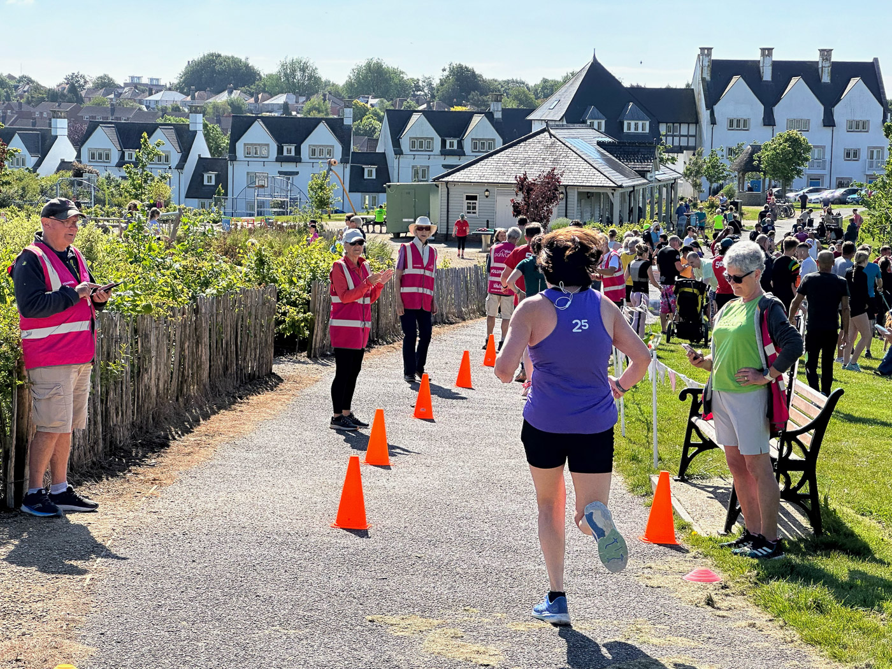

It’s been an odd week. I’ve continued to wrestle with some depressing and complicated personal life stuff that I won’t share. I write this as a reminder that despite the thoughts and feelings surrounding this ‘stuff’, I have continued to put one foot in front of the other and move forward. I’m pretty happy with what I’ve achieved this week at work and in terms of self-care.

## Last weekend

 Last weekend was a relatively chilled mix of family and domestic activities. I vaguely recall a trip to Portland Bill to watch the waves break on the rocks, mowing the lawn, and a trip to the recycling centre. I was also the Run Director at the Great Field parkrun. Everything went well; the sun came out, there were no incidents, there was a great gang of volunteers, and we had a massive turnout of 300 people starting and finishing.

## The work week (sorry it’s long!)

On Monday, I needed to finish writing and refining some final project outputs, but I struggled for a few hours to find the focus I needed. A pep talk from my Daughter, a hug, and a walk to grab a coffee helped me reset at lunchtime, and I made much better progress in the afternoon. I’ve been a bit rubbish about regular walking breaks recently, but this was a good reminder that I need them when working from home.

Outside of the project wrap-up, I’ve been trying to help Kate in our growth team with a tender response. I never actually feel helpful on these things, as writing isn’t my strongest suit. Still, luckily, there are some super intelligent colleagues involved in the response team who seemingly have this power. I’m hoping I’ve added value in facilitating, helping shape/challenge the delivery approach and figuring out the team and commercials. The response is already coming together, and I look forward to reviewing how things sit next week with fresher eyes.

I had my first one-to-one with Emma this week. As part of her new Director of Client Partnerships role, she has taken on the unenviable job of being my line manager. It was a good chat where I felt the warmth of good pastoral care and the buzz of energetically exchanging ideas. Some of these relate to my objectives, which all need refinement over the coming weeks. I must have said at least one smart thing during our chat because Emma thanked me for providing a ‘Hallelujah moment’ in her week. I’m not sure I remember what it was, but I was happy we’d both taken something away from our first session.

Thursday, I planned to spend a day at the London office. I haven’t done this for nearly six months. The last time I was there, I received a very distressing phone call, which was then the catalyst for my long period of absence in the new year and some of the complicated personal stuff I mentioned in opening this post (I hate being this cryptic by the way but you don’t need the ugly details). It’s fair to say I had some anxiety about making the trip and being back in a place that now holds some entirely mixed memories. In this period of withdrawal from the office, though, I’ve missed collaborating and hanging out with colleagues in real life, the change of scenery, and most of all, the support and joy of seeing my London-based friends. My plan was a quick in-and-out day with no overnight stay to dip my toes in the big city water, face any fears, and try to reset with positive experiences.

The day was, for the most part, a success. I was a little overwhelmed at various points in the day, but nothing quite tipped me into a meltdown. I had some nice micro catchups with some colleagues I haven’t seen or spoken to in ages. If anything, people’s kindness overwhelmed me more than my reaction to the space and the recollection of memories I was fearing. The couple of people in the office who were more aware of my circumstances checked in on me but also gave me the space I needed when I needed it. I may have even managed to get some work done!

 I met my good friend Sally for a late lunch. She was her usual kind, clever self with lots of advice, ideas and reassurance for me. She bought me a cheese straw and a coffee! Before I headed home, I grabbed a pint with our new starter, Ben U. Ben isn’t new to me - we worked together back in the FG days, and our paths have crossed a few times over the intervening years. We share many common interests, so catching up and hanging out was a lovely end to the London portion of the day.

Those who endured my Instagram stories yesterday will be surprised I have yet to mention THE F\*\*CKING TRAINS. Well, it’s best not to dwell, but my travel yesterday should have consisted of two 2hr 47min direct train journeys—one out and one back.
The outward journey to London took five and a half hours across three trains. The return journey was three trains and took six hours—not the same trains or routes. It was quite an adventure. So yeah, nearly 12 hours on trains for what resulted in about 4 hours in the office. Was it worth it? Yeah, probably! I have no regrets. Next week, I’ll be back for an overnight stay and a training course. Let’s hope the trains work.

## Other things

- I’ve managed a few short and slow runs this week—nothing amazing, but hopefully, the [start of something better](https://www.strava.com/activities/11577492943).
- I refactored my [old fire incident choropleth map](https://hellostu.xyz/posts/choropleth-experiments/), which now works on the newly migrated blog. I’m interested in playing with more data visualisation stuff, so it felt good to fix the old before starting the new.
- I’ve also noted that the rebuilt blog still has a [pretty low carbon footprint](https://www.websitecarbon.com/website/hellostu-xyz/). This pleases me as I’m still passionate about how this should be an important metric for all internet technology.
- I made homemade tacos for tea on Monday. They were delicious, and I used a [plant-based minced beef](https://this.co/products/mince/) alternative that wasn’t awful.
- I am still trying to watch [Lost](https://www.imdb.com/title/tt0411008/) - I have a love-and-hate relationship with it, but I think it’s growing on me. I also watched [Atlas on Netflix](https://www.netflix.com/gb/title/81012048), finished [A Promised Land \(Barak Obama\)](https://www.audible.co.uk/pd/A-Promised-Land-Audiobook/0241991420?ref_pageloadid=not_applicable&ref=a_author_Ba_c9_lProduct_1_1&pf_rd_p=af5062e9-57de-425c-9e02-6d8ad006b9aa&pf_rd_r=0HWJAB4VH2RANSGXDCZV&pageLoadId=4Pd3YBm1XbGpActm&creativeId=83220593-1d50-4883-bad4-b5d505543719) in audiobook format, swerved on [Less \(Patrick Grant\)](https://www.audible.co.uk/pd/Less-Audiobook/B0CVBM1N85?eac_link=47brnwQGKlbs&ref=web_search_eac_asin_3&eac_selected_type=asin&eac_selected=B0CVBM1N85&qid=5IHL5OpAxF&eac_id=258-3522918-8898231_5IHL5OpAxF&sr=1-3) and started [Vulture Capitalism \(Grace Blakeley\)](https://www.audible.co.uk/pd/Vulture-Capitalism-Audiobook/B0CWB8H4ZZ?eac_link=v54NPPn11PuN&ref=web_search_eac_asin_1&eac_selected_type=asin&eac_selected=B0CWB8H4ZZ&qid=AvcOkNeTtY&eac_id=258-3522918-8898231_AvcOkNeTtY&sr=1-1)

## Noteworthy Links

[Project vs Product Funding - Jennifer Pahlka](https://eatingpolicy.substack.com/p/project-vs-product-funding)

[Systems: The Purpose of a System is What It Does - Anil Dash](https://www.anildash.com/2024/05/29/systems-the-purpose-of-a-system/) ([via Mathew](https://documenteering.com/2024/06/05/anil-dash-systems-the-purpose-of-a-system-is-what-it-does/))

[Building trust in client/agency relationships - Neil Perkin](https://onlydeadfish.co.uk/2024/03/21/building-trust-in-client-agency-relationships/)
