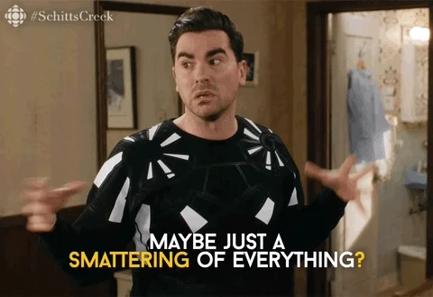

This week has been a real self-service buffet. I found the variety enjoyable, but the random assortment of cold pizza, carrot sticks, mini samosas, and party rings filling my plate didn’t quite satisfy my need for a more substantial meal!

### Some of the work

We finished the tender response I mentioned [last week](/posts/weeknote-london-calling). The team did a great job on it and I keep my fingers crossed that they are rewarded by getting through to the next stage. I also had positive news on two other potential bits of work I’ve helped shape. Both are very different and will need a little more effort to land, but it’s nice to know they are progressing after a little bit of a lull.

I spent all day Wednesday at a leadership and line management training course. It was well facilitated, and spending the day in person with TPX colleagues, old and new, was excellent. I didn’t learn many new things, but given the years I’ve spent managing and coaching people, I guess that was to be expected. It did serve as an excellent refresher and a moment for reflection. It also reminded me of some tools I could polish, sharpen, and use more regularly to be effective. I really feel I should pursue some more formal coaching training. I’ve started to explore this before, but life has gotten in the way. I need to give this more focus and attention. If you have thoughts or experiences you could share on this, please get in touch.

I’ve started to lean back into a small piece of internal work that I started a little while back and then had to put down while I was busy with client work. It has progressed well without me, but I can see it stalling a little, and I’m hopeful some renewed energy from me can help push it closer to the finish line, where it can start delivering some value.

### Being social

The training course meant an overnight stay in London. The lovely [Robbie Bates](https://www.linkedin.com/in/robbiebates/) made the trip to Aldgate, and we hung out, caught up and ate pizza. It feels good to get back into more social habits….but OMG, it’s so tiring! It could just be my age?!

### Making things

I built and added a new post navigation component to this site last weekend, so visitors can now page backwards and forward through blog posts - a slight but hopefully helpful improvement to the user experience. I also employed chatGPT to read and write improved post summaries for all of my old posts.

I stumbled across and started playing around with [ApexCharts.js](). It’s an excellent little charting library and felt more intuitive than others I’ve used before. This led me to update the few older posts where I’ve used charts and updated these components to use Apex. Revisiting [this parkrun post](https://hellostu.xyz/posts/TGF-data-dive/) was quite enjoyable—and it reminded me I should create a new parkrun data post soon.

### Other stuff

- Picked up my Guitar for the first time in months and had a play.
- Not enough running this week. I’m trying not to waste energy or create bad vibes by judging myself too harshly
- Audiobooks - finished [Vulture Capitalism \(Grace Blakeley\)](https://www.audible.co.uk/pd/Vulture-Capitalism-Audiobook/B0CWB8H4ZZ?eac_link=v54NPPn11PuN&ref=web_search_eac_asin_1&eac_selected_type=asin&eac_selected=B0CWB8H4ZZ&qid=AvcOkNeTtY&eac_id=258-3522918-8898231_AvcOkNeTtY&sr=1-1) and now moved onto [Growth - a reckoning \(Daniel Susskind\)](https://www.audible.co.uk/pd/Growth-Audiobook/B0CKJ33L4T).
- I’m slowly progressing through the backlog of [Lost](https://www.imdb.com/title/tt0411008/) episodes - Halfway through the last season. I’m still largely clueless about what is happening, but I’m enjoying the ride more.

### Noteworthy links

I enjoyed this post about [Monkey Tennis from Steph Gray](https://stephgray.com/2024/06/monkey-tennis-syndrome/)

Some great portraits in this post about [a photo competition via Positive News](https://www.positive.news/society/a-photography-competition-that-captures-the-beauty-and-diversity-of-humanity-has-revealed-its-shortlist/)

A nice reminder via [Neil Williams of a quote I’ve enjoyed before](https://neilojwilliams.net/how-you-feel-on-sunday-night/?utm_source=rss&utm_medium=rss&utm_campaign=how-you-feel-on-sunday-night)
