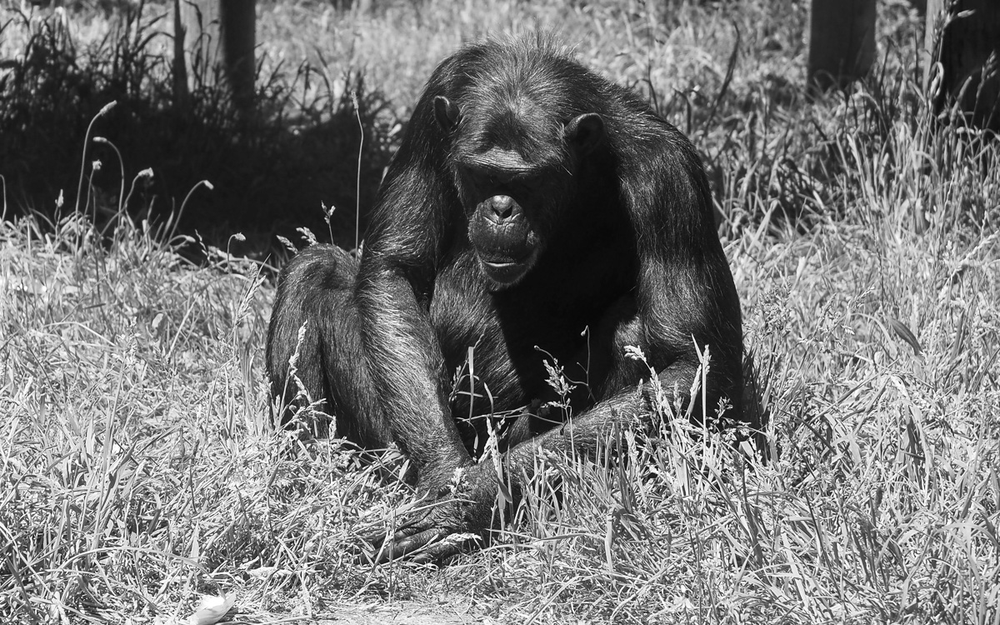

### Work

The work week was cut short by a two-day migraine, which followed a weekend of feeling pretty low for various reasons. I only work a four-day week when well, so there isn’t much to report from the remaining days. Highlights that stuck out;

- Given the limited time, I made significant progress on getting closer to landing the few bits of new work I nodded at last week. Two statements of work are now drafted with one client, and a draft proposal is taking shape for another. A lot of the heavy lifting has been done by my super-smart colleagues Julie and Jaskiran 🧠, but I know I’ve played a helpful and needed role across both pieces.
- I attended a client meeting that included interesting discussions about trialling weeknotes as a form of programme governance. Some good chat was had, and I found it interesting to see the range of reactions and interpretations of the ideas presented. I look forward to seeing how this progresses.
- We had our regular divisional ‘all hands’ meeting on Thursday. Jen kicked it off by sharing some wisdom, adeptly navigating some quite challenging/sensitive content and creating a short pause for folks to reflect. It felt wholesome and cheerful, and I think maybe I needed that moment, so I feel grateful 🙏
- I had a few interactions with colleagues in my team this week that have made me feel more grounded and reminded me I’m in great company. I look forward to spending more time with some of them IRL next week. Equally, at times, I do look around and feel like the odd one out…like they are all great, and I suck. I’m hoping that little imposter anxiety voice in my head can shut the f\*\*k up; cos, frankly, I have other more important things to be anxious about right now 😂

### Life

- Despite my sleep cycle being all over the place, my exercise routine mostly paused, and the migraine, I’ve still found moments of calm and ways to exercise mindfulness. I’ve felt supported by friends, family and colleagues.
- I finally finished [Lost](https://www.imdb.com/title/tt0411008/). Possibly the worst ending of a show EVER! I’m glad it’s done.
- I’ve re-watched too many episodes of [Enterprise](https://www.imdb.com/title/tt0244365/) to be healthy in one week. I’ve just started re-watching [The Bear](https://www.imdb.com/title/tt14452776/) in anticipation of the new season. This was prompted by one of the posts listed below.
- Today, my Daughter Robyn (who will be 22 next Tuesday 🤯) and I visited the [Dorset Ape Rescue Centre](https://monkeyworld.org/) as a belated Father’s Day activity. I find monkeys fascinating, and normally, I come away with a memory card full of photos. Today was different, and the joy came from spending time with Robyn just being. I took about 20 photos, and the one above is the only one worth sharing.

### Noteworthy links

[Enjoy every Sandwich](https://triumphofentropy.substack.com/p/enjoy-every-sandwich) by fellow TPX’er Chris Holding. I don’t know Chris well, but this popped up on Linked.in, and I really enjoyed this post and the reminder about the new season of The Bear.

[I Will Fucking Piledrive You If You Mention AI Again](https://ludic.mataroa.blog/blog/i-will-fucking-piledrive-you-if-you-mention-ai-again/) - shared via Jukesie. This blogger has now been added to my RSS feed of favourite blogs. There is some excellent, well-reasoned and entertaining reading on this site.

[You can outsource risk, but you can't outsource reputation](https://shkspr.mobi/blog/2024/06/you-can-outsource-risk-but-you-cant-outsource-reputation/) - Wise words from Terence Eden on the back of recent cyber events.

[Who’s doing interesting work right now?](https://documenteering.com/2024/06/19/whos-doing-interesting-work-right-now/) A great question shared by Mathew that made me think that I’d struggle to answer this right now. I should probably look harder.
