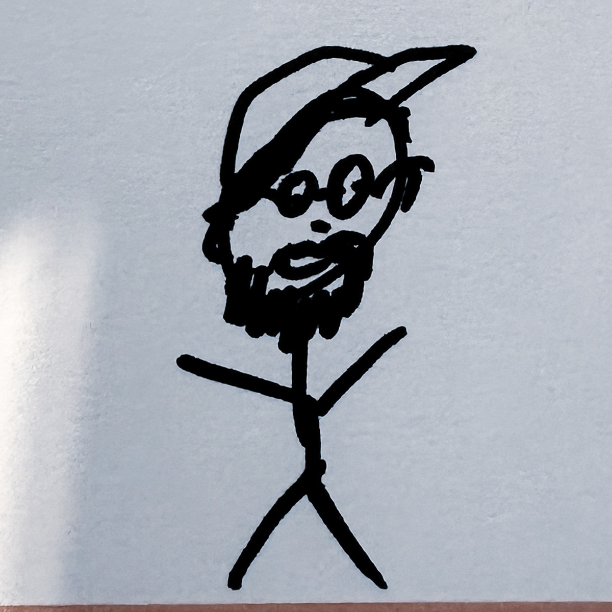

### Last weekend

The weekend is mostly now a blurry memory. I marshalled at parkrun. I caught up for a much-needed pint and chatted about the deep life stuff with my good friend Paul. The rest of it was life admin connected to pending life changes. This was draining but necessary.

### The work

2 days out of 4 working days were spent in London. I’m starting to slowly feel more comfortable commuting again and being in the big city.

Two of the three bits of future work are now signed off, and my effort has shifted to securing the right team. I look forward to setting up delivery and moving on to the first of these projects next week. I’m happier when I’m leaning into projects and surrounded by a team. The 3rd is still nudging ahead slowly, but now it looks likely not to be a thing until late summer - that’s ok. I’d rather we do the work when it’s ready to be worked on than rush and compromise our ability to deliver value.

On Wednesday, I met up with my fellow team members IRL. There isn’t a bad apple in the barrel - everybody is hardworking, smart, talented and caring. Sickening! We spent time together chewing over meaty problems, being human, breaking out post-it notes and thinking through ways to support the broader community of project leads (and ourselves). Many good discussions were had, and plans are starting to come together about how we, as a team and a community of practice, can work in the open more, get advice/support/challenge, and share knowledge more easily across our growing internal & external networks. I’m hopeful that if we lead these things well, we also have an opportunity to reduce the amount of time spent feeding the accountability and reporting machine that, in places, has become burdensome. Things were documented, we took away actions, and I enjoyed getting to know folks better. A good day!

Simon drew the included portrait of me. I think it’s flattering (look at the itty bitty waist 😂)

Trains home from London were broken (yes, again!). I got as far as Southampton, where I joined a random party of 5 in an Uber to Bournemouth. Chloe then kindly drove to Bournemouth to pick me up for the final leg home.

### Uber

The Uber trip was a fun little glimpse into the lives of total strangers and how humans interact in these odd situations. The conversation was lively; topics included work, travel, and views on the future of the NHS. My fellow travellers included one who works in marketing for a university, another who works in HR but is moving into architecture, a guy who works with international students and a doctor’s secretary who was travelling to Bournemouth for her holiday.

My attention was split between the conversation and how I’d explain my job if anybody asked me. Luckily, nobody did. Everyone seemed to enjoy the ride apart from the Uber driver - the largely silent 6th subject in this forced impromptu social experiment. I’d keep quiet if I was busy busting my chops to pay my bills and put food on the table by driving a cab for some idiot who over-analyses the ride as an interesting social experiment to distract himself from the oppressive heat, the connected climate crisis and continued depressing breakdown of our national transport infrastructure 😬🫣. Five stars were given. I got home.

### Life

- Family - My Daughter Robyn turned 22 this week! Clucking bell, it’s made me feel old. At least one evening was spent reminiscing and looking back through old photos and family videos to curate the now-traditional annual Instagram birthday stories. I’m not embarrassed to admit that reviewing these photos and listening to music on the train to London on Tuesday morning might have given me a slightly misty-eyed moment.
- Exercise - Hmm, there is nothing to write here. Next week, mmK?
- Cars - I’ve been looking at options to replace our current car (for many reasons that are not worth writing about). Toying with using employee perk of Octopus EV leasing scheme. I have a call booked next week to discuss some options. 🚗
- TV - I re-watched seasons 1 & 2 of [The Bear]() this week and am ready to dive into S3 this weekend. I unexpectedly smashed through and enjoyed [Bodkin on Netflix](https://www.netflix.com/gb/title/81423482). It’s a good, fun story about stories and storytelling.
- Audiobooks - Mostly chewing through [A world without work](https://www.audible.co.uk/pd/A-World-Without-Work-Audiobook/0241442869).

### Noteworthy links

I’ve read and enjoyed many things, but this week, I’ve been awful at noting or bookmarking the good ones, and I do not have the energy to look through my browser history. Soz!

So I don’t leave you totally without things to click on, here is a link to my [favourite album of 2024](https://open.spotify.com/artist/2RQXRUsr4IW1f3mKyKsy4B) (so far!). Have a great week internet travellers ✊
