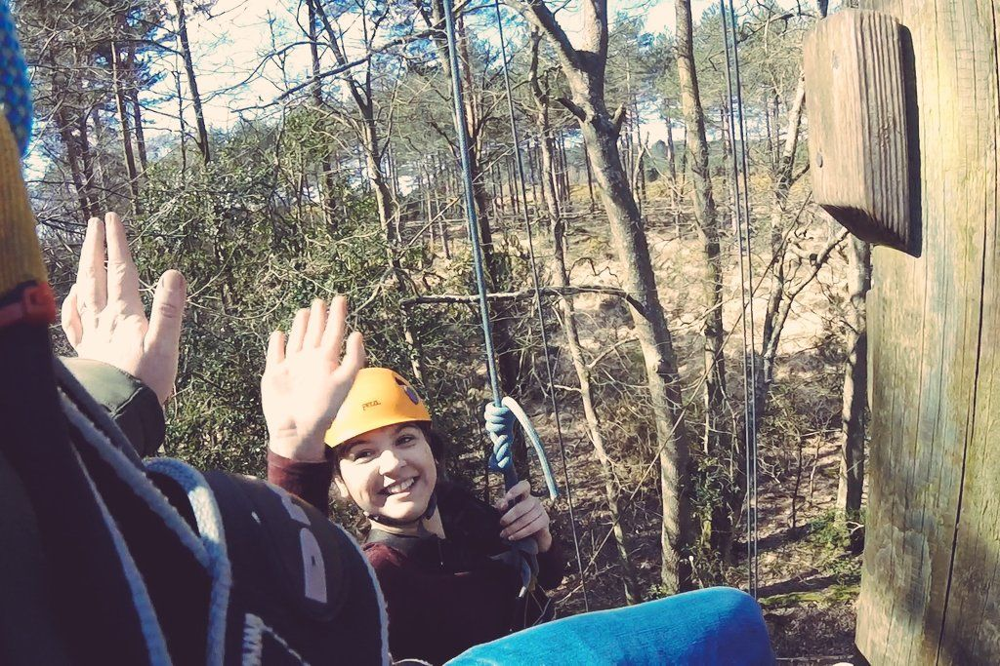
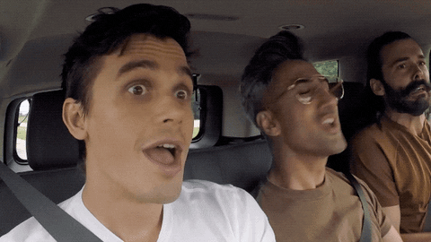

_I'm back for a second week. Yay! but no longer on Medium. It potentially limits my audience but I'm not writing for fame and fortune so that's ok._

Last weekend [Chloe](https://twitter.com/mummyclover) had organised for [Robyn](https://www.instagram.com/sleepyrobyn/) and I to join her and some of her work colleagues to tackle a [high ropes course](https://www.brenscombeoutdoor.co.uk/burnbake-ropes-course) at a nearby outdoor adventure centre. I'm quite glad I had forgotten about this event in the calendar until the night before - I'm not overly keen on heights (actually quite scared it turns out) and not having much time to talk myself out of it was probably for the best.

I won't go into all the details of the day but it was a great experience and a fun way to spend time as a family. I ended up pushing myself much further (and higher) than I thought possible.

I've been reflecting on the factors that got me both beyond my comfort zone and to a position where I could value the new perspective that this gave me (in a literal sense when your [30ft above the ground](https://www.instagram.com/p/BvZG9bIASM7/)). I appreciate it's a bit of a cliché to draw parallels between this and practicing as a consultant but it was a really well facilitated experience over a period of just a few hours which makes it super easy to identify the things that were put in place that helped achieve this positive outcome.

Here's what I noted...

- Our guides were both experienced in their field, passionate about it and great communicators.
  We were told what to expect at the start of the day and then were given more relevant detail just ahead of us moving to the next stage.
- Important messages were repeated and reinforced often throughout the experience.
- We were provided with tools and methods that allowed us to achieve progress but also keep us safe.
- Knowledge of the tools/methods was openly shared. Knowledge of how to get the most out of the tools - how & when to apply what tool and for what purpose was freely given.
- Our guides often asked how we felt and what we were thinking and used this to shape the next steps.
- Our guides offered lots of challenge but also advice and support. They let us make our own decisions about how far we were willing to go. We were left largely in control of our experience.
- Plans were in place if things went wrong or the unexpected happened which was reassuring.
- We were encouraged to support each other throughout. Over the course of the session we increasingly became more reliant on each other than the guides. This was planned.
- They were genuinely pleased to see us succeed and encouraged us to celebrate success as individuals and as a teams.
  Progress was made in stages. The ambition was made clear but the guides broke the experience down into more realistic and achievable goals.
- They made it fun. This helped counter some of the more stressful or tense moments.

I like to think there is plenty above I already bring into my work practice but there is always room for improvement. I'll be chewing over this list now i've got it out of my head to see what I might try tweaking or changing. I'm Interested to hear if any of this resonates with you?I'm rambling...onto the highlights - I'll keep them brief.

## Highlights of the week

**Study...** I Continue to learn lots on [my course](https://theodi.org/event/better-data-better-decisions-2019-edition/). I got a great result for [last weeks assignment](https://d1sc0.github.io/odi_assignment3/) submission and this week has me exploring more new tools and methods. I'm starting to form a few little pet project ideas in my mind to keep me applying what I've learnt and experimenting with tools once the course comes to an end in a week or so. I'm hooked on data!

**New projects and teams...** I've been in a couple of planning sessions this week for new projects. The projects are super interesting and I'm looking forward to working with some new team members. One project in particular will see me contributing to some strategy work (which is well timed based on my learning from last week). **I'm very excited!**

**Being social...** The week also included a nice breakfast catch-up with an old FG friend, a pint or 3 with [Jan](https://twitter.com/Jottblum) on Wednesday night and some team food and drinks to mark an important milestone on a critical project on Thursday. Probably a more boozy week than it should be? Yes. #notsorry

## A few of my favourite things

**Clicks:**  
[Why have difficult conversations when you can talk about tools instead?](https://twitter.com/ewebber/status/1111192864313262080) 😍  
[Strategy needs good words](https://martinweigel.org/2019/03/20/strategy-needs-good-words/) 💯  
[Benefits of being a vulnerable leader](https://www.inc.com/marcel-schwantes/what-does-it-take-to-be-an-effective-leader-research-nails-down-answer-to-1-rare-trait.html) 🤔

**Tune:**  
[Tom Jones - Burning down the house](https://www.youtube.com/watch?v=iYuldgIOelY) (From the Homes England playlist 🏡)

**From the 'Gram:**
[Video from our tree top challenge](https://www.instagram.com/p/BvZG9bIASM7)
