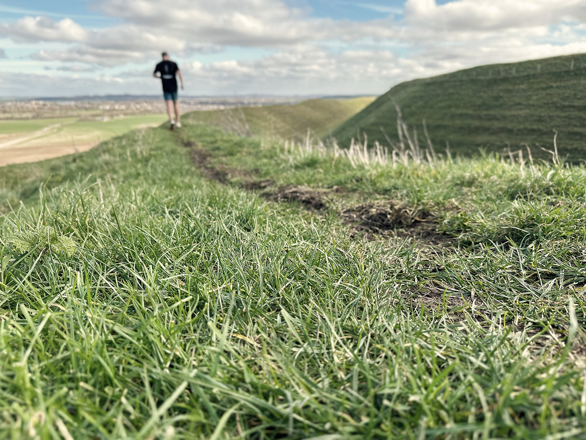

I’m very late posting this shot. It was shot last Sunday. I opted for a simple snap on the iPhone while out for a trail run, as I had a jam-packed weekend and no time for anything grander. This is not only the second iPhone shot of the project so far, but it’s also the second time an age iron hill fort has been the location. I love running around these places. They are just stunning.

I was going to accompany this picture with some thoughts from the week preceding its capture, but as I’ve now caught up with myself by posting so late, I’ll save those for a new post, hopefully landing tomorrow. See you soon 😘
